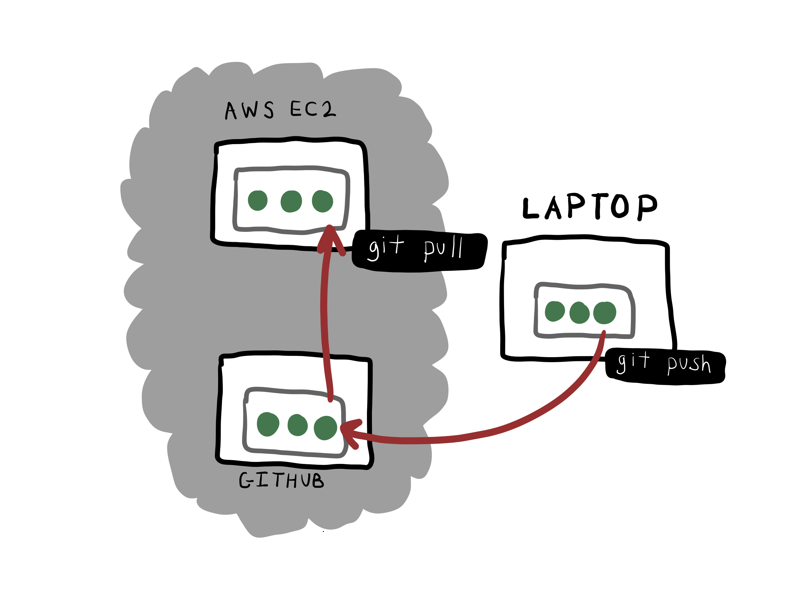

# 0.5.1: Git Pull



So far, we've been able to create a new repository on GitHub. We've forked a repository into our own Github account. We've `clone`d a repository on GitHub, that is, download the repository to our local computer and `push`ed and repo changes from our computer onto the GitHub copy of the repository.

Now that we have a separate copy of our repository on a second computer with AWS EC2, we need to talk about another situation, where we:

1. Made changes on our local computer
2. `push`ed changes to our GitHub repository
3. Want to get those new changes onto our AWS EC2 copy of the repository.

This last step is called a `git pull`. Git pull gets the latest set of commits from a remote repo.

While ssh'd into the AWS EC2 instance:

```text
git pull
```

#### Origin

We can also run a more specific command:

```text
git pull origin main
```

This command specifies that we want to pull from origin \(GitHub, the place where the repo was cloned from\) and the name of the branch. 

