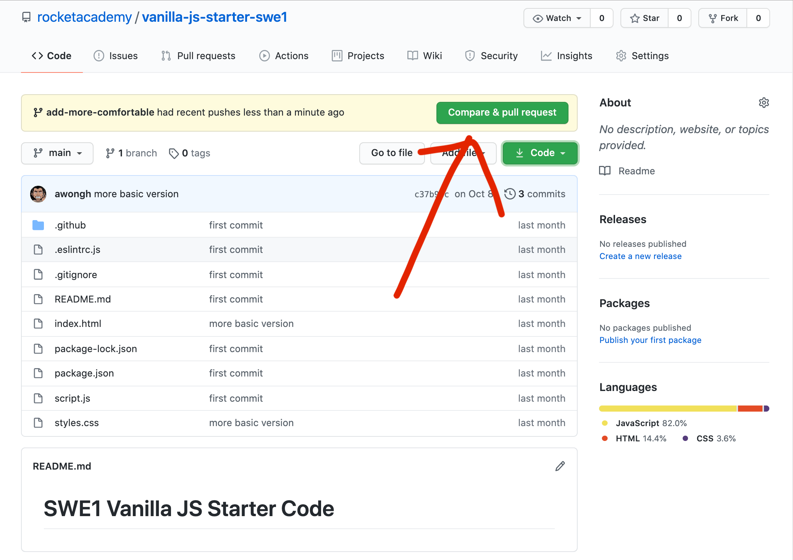
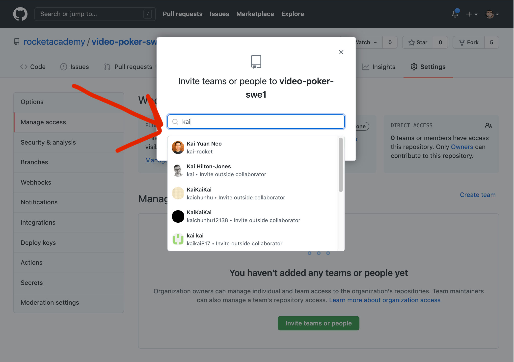

# 0.ICE.1: Git Branches

For this exercise we'll be creating a GitHub repo from scratch and creating branches for the repo.

## GitHub Repo Creation

Begin by creating a repo on GitHub.

When you create the repo also choose to create a README.md file as well, so that the repo does not start empty.

Clone the repo:

```text
git clone <REPO_URL>
```

cd into the repo and add this JavaScript file.

### index.js

```javascript
let name = process.argv[2];
console.log(`hello ${name.toUpperCase()}! How are you?`);
```

Add, commit and push this file to GitHub.

## Branch

Create a repo branch. Note that branch names are typically in kebab-case.

```bash
git checkout -b add-json
```

Add a `data.json` file and change the `index.js`

### data.json

```javascript
{
  "names": []
}
```

### index.js

```javascript
import { writeFile } from 'fs';

let name = process.argv[2];

writeFile('data.json', name, (error) => console.log('err ->', error));
```

## Push Changes to GitHub

`origin` is the default [Git Remote](https://git-scm.com/docs/git-remote.html). A Git Remote is a a remote repository that this local repository is linked to. `git push` has 2 optional parameters. 1st is the remote to push to, and 2nd is the branch to push to at that remote.

```javascript
git push origin add-json
```

After running this command, Git may prompt us to "set an upstream branch", i.e. to set a default branch to push to and pull from. [Here](https://stackoverflow.com/questions/37770467/why-do-i-have-to-git-push-set-upstream-origin-branch) is why.

Go to the GitHub website to see your changes. Use the branch dropdown:


## Main

Checkout the main branch again and make a change to `index.js` on line `2`:

```javascript
console.log(`good day ${name}, are you well?`);
```

Add, commit and push this change to GitHub.

## Pull Request

When you push to a branch you'll get a GitHub message asking you if you want to make a pull request.

You can click the green button to see a comparison against your main branch \(or any other branch\), and whether or not there will be any merge conflicts. \(Clicking won't actually create a pull request\).

A typical workflow for PRs is to view the code changes in GitHub with convenient highlighting of changes, then go back to our editor to make code changes and test. We can technically make code changes and resolve merge conflicts from within GitHub Pull Requests, but this is discouraged because there is no way to test code changes from within GitHub.



## 2nd User Branch

Add your partner as a contributor to the repo:

1. Go to the settings tab of the repo.
2. Click **Manage Access** on the left side column menu.
3. Click the green **Invite teams or people** button.


Type to autocomplete their GitHub username.



They will receive an email with an invite to collaborate. \(This notification doesn't show up on the GitHub website\).

## Change Partner Repo

Once you are a collaborator, checkout the repo:

```text
git clone <REPO_URL>
```

Create a new branch and make a change to line `2` of the `index.js` file.

```javascript
console.log(`yo ${name}, what's up dude.`);
```

Add, commit and push this change.

## Team Work

When we begin to collaborate on code, a pull request is the main way we'll be able to control what is happening within a project.

Each team mate will create a branch for the feature they are working on and create a pull request when they are done with that feature.

Create a pull request with the changes you made on the branch.

## Git Pull

To get the current set of changes on a branch that exists on GitHub but doesn't exist on your own branch, use `git pull`.

```text
git checkout main
git pull origin main
```

Note that for now, you have to be on the same branch as the one you are pulling from. Otherwise you are basically doing a merge.

When you do the pull you'll see the code change to the version that is the same as GitHub.

