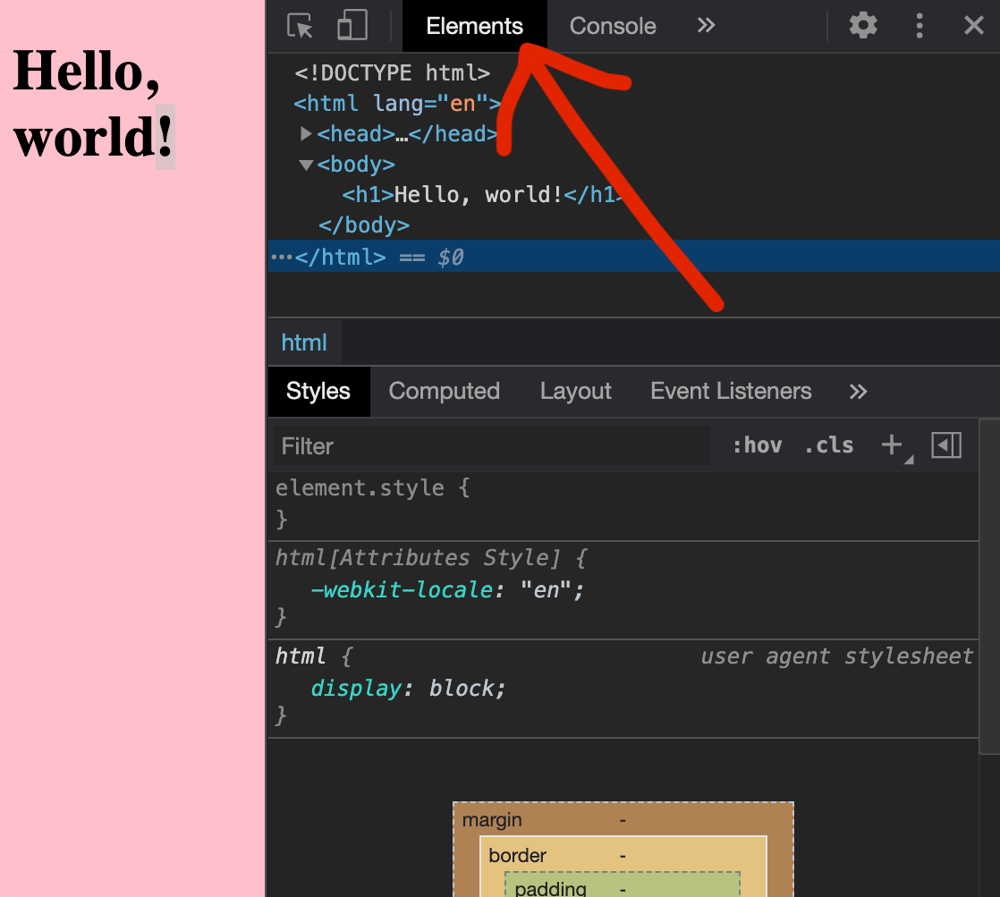
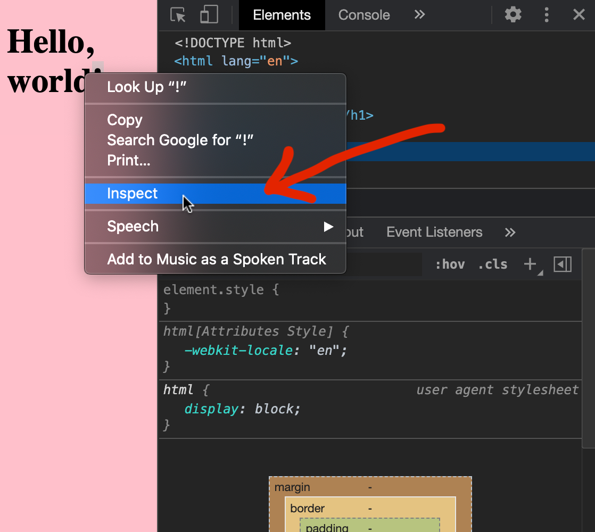
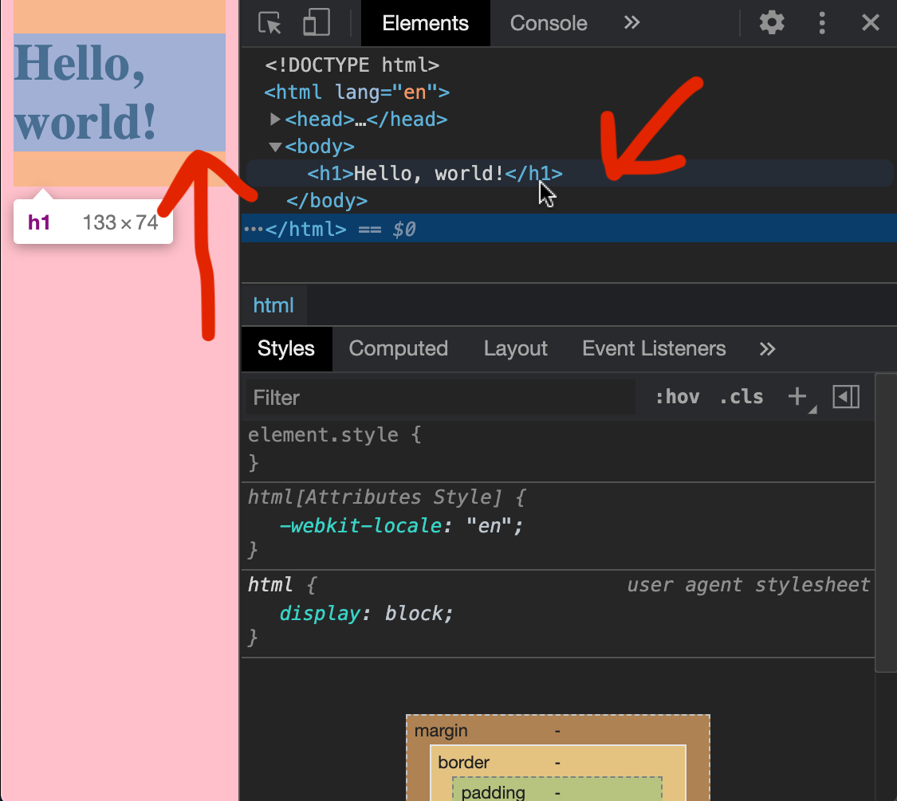

# 1.1.1: Basic HTML

## 1.1.1: Basic HTML

## Why HTML

HTML pages and the software that transfers HTML pages is still the basis for the internet as seen through a browser. A browser's fundamental task is to display HTML documents and deal with built in HTML behaviors.

## What is HTML

HTML originated as a way to specify the format and data of a document. Today HTML is used as a building block in creating complex applications we use in the browser. HTML is not a programming language in the same sense that JavaScript is a programming language because it does not have any syntax for logical control flow, such as functions, loops or conditionals.

### Writing HTML

#### Chrome Browser

Chrome Dev Tools gives us functionality to relate the content we see on the browser screen to the HTML code in the file. This is the _elements tab_.

The elements tab tells us visually about what HTML elements are on screen.








#### Errors

HTML does not run like other programming languages in the sense that even if HTML is written improperly, or there is an error in the syntax, the browser \(all browsers\) attempt to render the document as a "best effort" based on the HTML file. For this reason there will never be any error warning text when coding HTML incorrectly.

### Semantic HTML

A major feature of the HTML language is that the specification of the document is also information about the content of the document. When an HTML document uses the `h1` tag, regardless of the words inside, that tag says that the content inside is more important than the content inside the `h2` tag elsewhere on the page.

HTML documents that use specific tags to communicate about the content of the document is called semantic HTML.

In fact, this property is used by search engines like Google. A website search engine is an application that digests web pages on the internet, and when a user does a search, tries to find the relevant, previously digested page. Google and others use the `h1` tag to know that the text inside is more likely to be the title of a page, and weighs that text more heavily than other text like `h2`.

```markup
<h1>Important Text</h1>
<h2>Less Important Text</>
```

We'll see when we begin to write more CSS that the visual differentiation between `h1` and `h2` \(or between any element and any other element\) can be overridden with CSS. In this sense, the selection of the "correct" HTML tag has less to do with how it looks, but what part of the document it represents.

## Exercises

This exercise lists out the most common elements that we'll be using during the course.

### freeCodeCamp Intro to HTML

These exercises cover the basics of HTML and making different kinds of elements appear on the screen.


This material also covers `<form>` and various form input tags, which we won't be using until Module 3.




