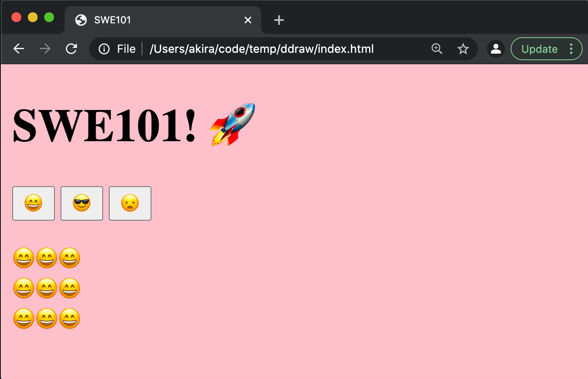

# 1.ICE.1: Drawing DOM

## Introduction

Let's practise drawing HTML elements using DOM code.

## Base

Begin with the [DOM starter code](https://github.com/rocketacademy/swe101-next-steps-dom).

### Emoji-Displaying Buttons

When the page loads use JavaScript to create 3 buttons on the screen. The HTML would look something like the following.

```markup
<div>
  <button>😄</button>
  <button>😎</button>
  <button>😦</button>
</div>
```

When the user clicks on a button use a loop within a loop to create a square emoji figure. Consider using the `innerHtml` method to insert HTML into a `div`.



Just like in the original drawing exercise you can use `<br/>` to create the new lines of the figure.

```markup
<p>
  😄😄😄<br/>
  😄😄😄<br/>
  😄😄😄<br/>
</p>
```

When the user clicks another button the current figure is erased and a new one put in its place. 

### Any Emoji-Displaying Buttons

Create an array of [more than 3 emoji](https://gist.github.com/anthonydelgado/528d1fab9242067348c0ac25f873d7f0). Use this array to create a button for each emoji that performs the same functionality as above.


We may wish to use anonymous functions \(functions without names\) to accomplish this. For example, we could use a `drawEmoji` function that re-uses our code to draw emojis, that receives an emoji type as input. 

```javascript
smileEmojiButton.addEventListener('click', () => drawEmoji('😊'));
```

We wrap `drawEmoji` inside an anonymous function because we only want `drawEmoji` to run when the click event happens. The following code would not work because `drawEmoji` would be called when the JS file loads, and not on click.

```javascript
smileEmojiButton.addEventListener('click', drawEmoji('😊'));
```


## Comfortable

### Variable Number of Emoji

Create a keydown event listener that determines how many emojis to print. For select keys on the keyboard, assign a number of emojis to appear. For example, we may decide "a" makes 12 emojis appear, and "b" makes 16. When a user clicks an emoji button, set the emoji type without displaying the emoji. When the user presses a key that determines a number of emoji, display that number of the selected emoji type.

### Randomise

Create a randomise button that randomises the number and emoji.

### Up-Down Arrows for Number of Emoji

Apply a keydown event listener to the up and down arrows. When a user presses these keys the number of emojis to display increases or decreases by one respectively.

## More Comfortable

### Absolute Position, Z-Index

When the user clicks an emoji button, display those emoji over or under the currently-displayed sets. If the new emoji set is bigger than another, it appears underneath. If the new emoji set is smaller than another, it appears on top. Emoji sets are top-left aligned.

### Up-Down Arrows for Emoji Size

Update up-down keydown event listeners such that when the user presses these keys the emojis on screen get larger or smaller respectively.

