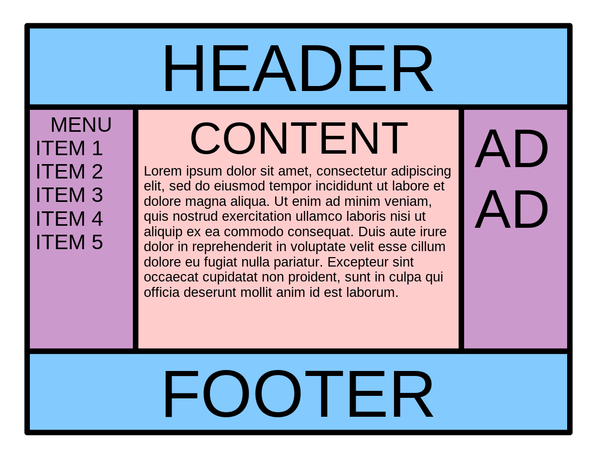

# 1.1.3: CSS Layout

## Introduction



All webpages comprise a series of nested boxes that have CSS styles applied to each of them. The Learn Layout page in the Exercises section below cover all CSS basics to compose these boxes. 

## Exercises

The follow exercises are from [Learn Layout](https://learnlayout.com/). We will complete the first 16 pages and ignore pages 17-19. **After reading each page, implement the code to see how it works.**

### Part 1: Pages 1 to 8

Complete pages 1 to 8 at [https://learnlayout.com/](https://learnlayout.com/).

### Part 2: Pages 9 to 16

Complete pages 9 to 16 at [https://learnlayout.com/](https://learnlayout.com/).

## Meta Viewport

Exercise 14 above mentions adding the viewport tag. If we want our mobile-first layouts to look good we need to add this tag so that the device knows how to properly scale the layout of the page. Read more about the viewport tag [here](https://developer.mozilla.org/en-US/docs/Web/HTML/Viewport_meta_tag).

```markup
<meta name="viewport" content="width=device-width, initial-scale=1, shrink-to-fit=no">
```

