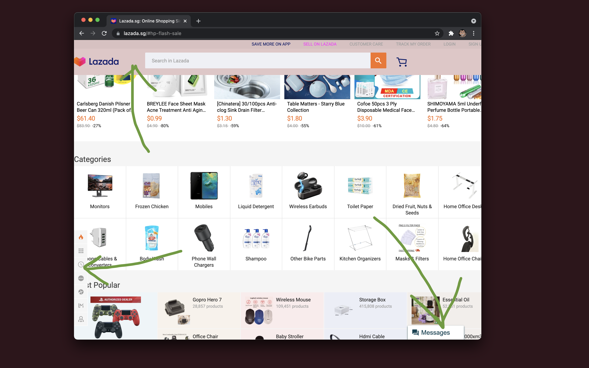

# 1.1.3.7: Position

When describing the functionality of elements with display we are discussing what happens when we fill elements with a certain amount of contents \(text, images, other boxes, etc.\), and then we let CSS lay out those boxes according to predetermined rules. The browser layout engine adjusts the size, shape and location of a set of elements and boxes based on:

1. The CSS box model
2. The display property
3. The contents of the box

There are a lot of overlapping rules to the behaviour of boxes using these attributes. Thus, there are some more **rare** cases when, instead of allowing CSS to lay out those boxes according to size and rules, we want to have a higher degree of control over where those boxes get placed.

This level of control is the `position` style. This style overrides any natural display layout behaviour in favor of more specific instructions of where to put a box.

### Position Fixed

```css
p{
    position:fixed;
}
```

Use cases:

* navigation bars
* chat windows



### Setting Position

```css
p{
    position:fixed;
    top:300px;
}
```

### Position Relative

```css
p{
    position:relative;
    top:6px;
    left:6px;
}
```

\(Relative position is rarely used on it's own.\)

### Position Absolute

```css
p{
    position:absolute;
    top:6px;
    left:6px;
}
```

\(Absolute position is rarely used on it's own.\)

### Position Relative / Absolute

```css
.card{
    position:relative;
}

.icon{
    position:absolute;
    top:6px;
    left:6px;
}
```

Use cases:

* images that overlap contents in front or behind
* game-like elements that are inside something with pixel-fixed dimensions
* icons inside an element
* notification count numbers


