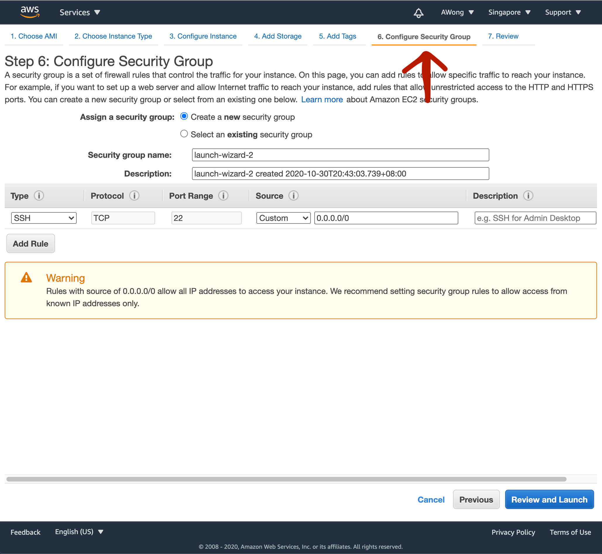
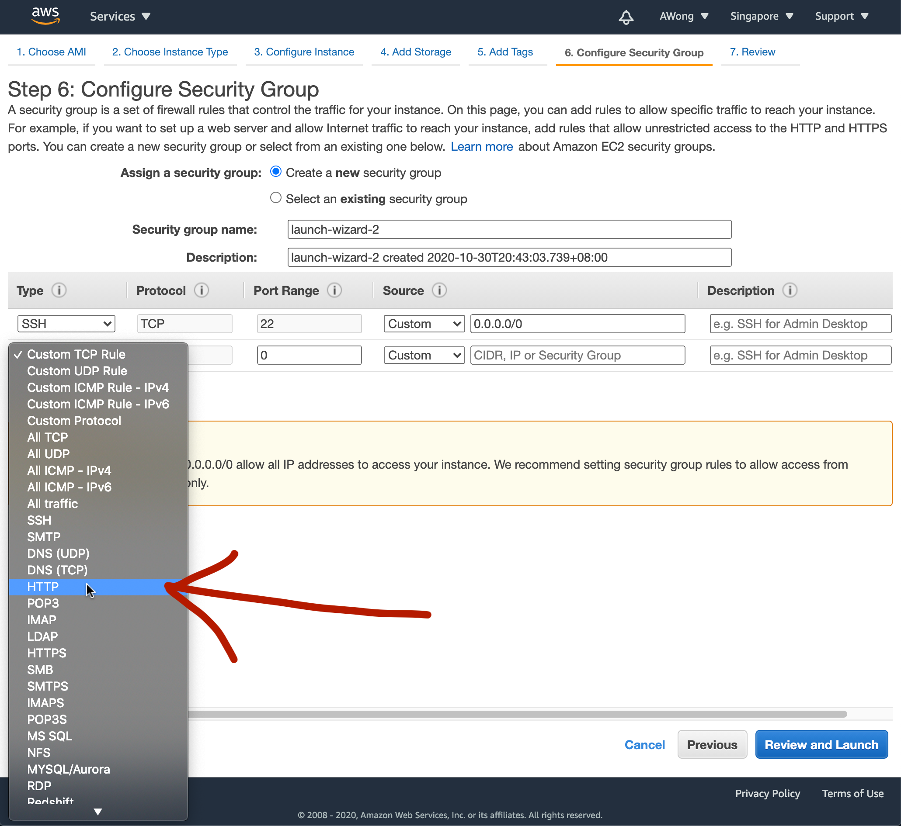
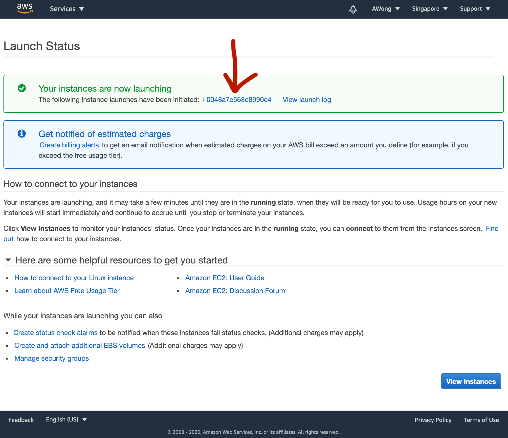
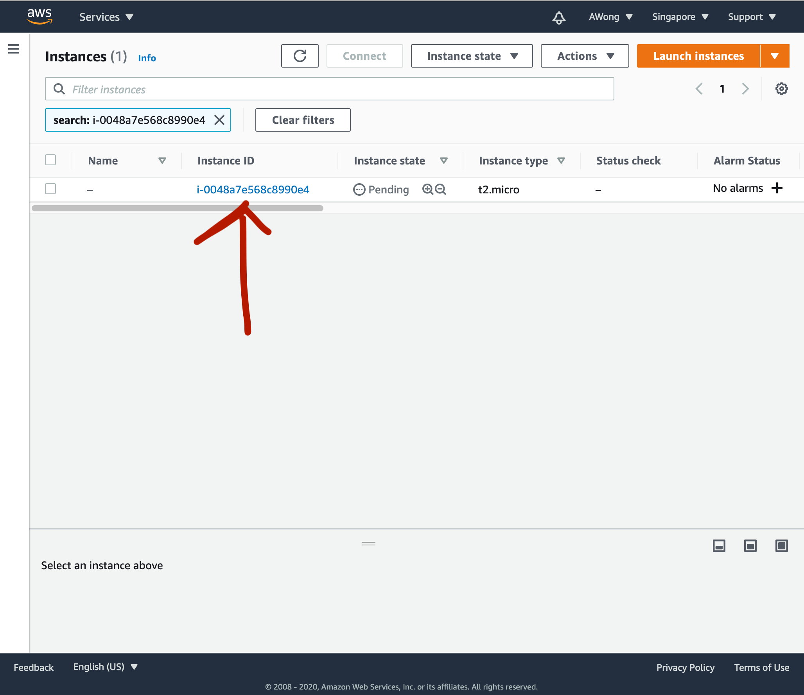
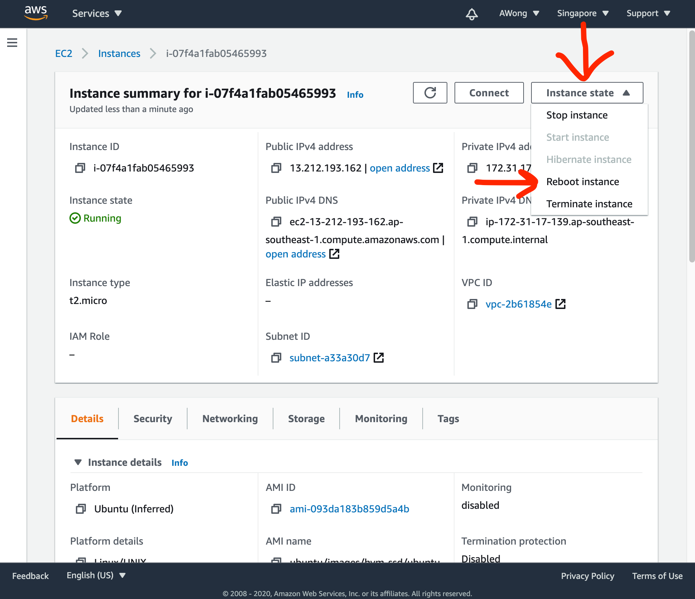

# 2.11: AWS Deployment

## Introduction

AWS EC2 allows us to rent computers remotely and run code on them. EC2 is on the "cloud", which means we can request AWS to create you a virtualised computer "instance" \(AWS' terminology\). We'll use this instance as a place to run our Node.js code and act as a server. This instance will have an IP address that is public on the internet.

## Create an AWS EC2 Instance

[Log into AWS EC2](https://ap-southeast-1.console.aws.amazon.com/ec2). That link assures you are in the Singapore AWS region. 

Click the Launch Instance button.


Click to choose the Ubuntu version 20.04 AMI. An AMI is a "snapshot" of a computing instance. In the listed options, each snapshot represents a different operating system. AMIs can also be used as snapshots of instances we wish to replicate with specific software installed on them beyond the OS.


Make sure to select the free "micro" EC2 instance type. This is because micro is free and suits our needs.

Skip ahead by clicking to the Configure Security Group tab.


Security groups are used to control access to specific sets of resources in AWS. We want to change ours to allow public HTTP port 80 requests. Click the Add Rule button.



Select HTTP from the dropdown.



The default configuration will give you HTTP on port 80.


Click to Review and click the blue Launch button at the bottom.


AWS will bring up a modal and ask you about how you plan to access the instance.

Choose to create a new key pair, name it, and click the Download button. Key pairs are typically stored in the `~/.ssh` directory on Unix machines by convention. More on SSH below.

After you've downloaded the key pair, click the Launch Instance button. There's no way to access the instance if you didn't download the key pair first. The key pair is based on [public-key cryptography](https://en.wikipedia.org/wiki/Public-key_cryptography), a common alternative authentication method to username and password.


You will be taken to the Instance Launching page. Click the link to your new instance.



Once you're on the instance list view click into your new instance.



The instance detail page will show you the public IP of your instance. Note that there is also a private IP address which is used for private communication between our machines in AWS. More information on IP addressing in AWS [here](https://docs.aws.amazon.com/vpc/latest/userguide/vpc-ip-addressing.html).


Note that the "open address" link defaults to https, which won't work with our http-only server code.

## SSH - Log In

SSH stands for "Secure Shell" and is one of the most common and secure ways to access servers remotely. It allows us to "log in" to remote servers and manipulate them via the command line. Communication over SSH is encrypted.

Change the permissions of the downloaded key file to 400. This means the owner of the key file \(i.e. you\) will be able to read and write to this file. More information on Unix file permissions [here](https://www.tutorialspoint.com/unix/unix-file-permission.htm). 

```text
chmod 400 path/to/keyfile
```

SSH into the instance. `-i` is a parameter that allows us to specify the keyfile we wish to use. `ubuntu@` specifies that we wish to SSH to the server as the `ubuntu` user, which is the default user for Ubuntu machines. `<EC2_PUBLIC_IP>` is the public IP for our server.

```text
ssh -i /path/to/keyfile ubuntu@<EC2_PUBLIC_IP>
```

[https://docs.aws.amazon.com/AWSEC2/latest/UserGuide/AccessingInstancesLinux.html](https://docs.aws.amazon.com/AWSEC2/latest/UserGuide/AccessingInstancesLinux.html)

## Just Another Computer

You are now using the terminal, but on a computer that belongs to AWS.

Use some command line commands to look around this computer. \(This computer has no Graphical User Interface\).

```
ls -la
```

Find a file or directory that you also have on your own computer. Use `cd` if you need to. 

To prove this is just like your computer, create a file:

```text
touch mytext.txt
```

Type any other command line commands you want. Are there any you can or can't run?

## Install Node.js

```text
curl -sL https://deb.nodesource.com/setup_lts.x | sudo -E bash -
sudo apt-get install -y nodejs
```

On the Ubuntu operating system \(and all other [Debian derived](https://en.wikipedia.org/wiki/List_of_Linux_distributions#Debian-based) systems\) APT is the family of commands that manages installing packages on the system. See more about APT [here](https://itsfoss.com/apt-get-linux-guide/). Other package managers like Homebrew are less commonly used on Ubuntu.

## Run a Server

Get the example server code from Rocket Academy's GitHub. GitHub is the primary way we will be transferring files to and from our servers. We could use a more direct file transfer method such as [SCP](https://en.wikipedia.org/wiki/Secure_copy_protocol), but that allows more potential for human error.

```text
git clone https://github.com/rocketacademy/file-server-example-swe1
```

```text
cd file-server-example-swe1
```

```text
sudo node index.js 80
```

Test it by requesting the server at your IP address. It should look something like http://&lt;MY\_EC2\_IP_\__ADDRESS&gt;/index.html.

## Logout 

Type `exit`.

```text
exit
```

## Permanently Running Server

By default, when we logout the server will stop running.

Run the following command to keep the server running after we logout.

```text
nohup sudo node index.js &
```

[`nohup`](https://en.wikipedia.org/wiki/Nohup) stands for "no hang up". The `&` after our command tells Unix to run the command in the background, freeing up our shell instance to perform other commands, such as `exit`to logout.

## Quit the permanently running Server

Each running process on a computer has an ID.

To quit the server we have to find the ID number \(PID, which stands for Process ID\) and use it to kill that process in the instance.

Get a list of all processes: 

```text
ps -ax
```

Filter the list of processes by using the unix [pipe](https://en.wikipedia.org/wiki/Pipeline_%28Unix%29) `|` to send it to the [`grep`](https://en.wikipedia.org/wiki/Grep) command.

```text
ps -ax | grep node
```

Take note of the PID and use it to run [`kill`](https://en.wikipedia.org/wiki/Kill_%28command%29). `-9` represents the SIGKILL signal that force-kills the process.

```text
kill -9 <NODE_SERVER_PID>
```

Check that your server is not running by attempting a request.

## Restart the Entire Instance



