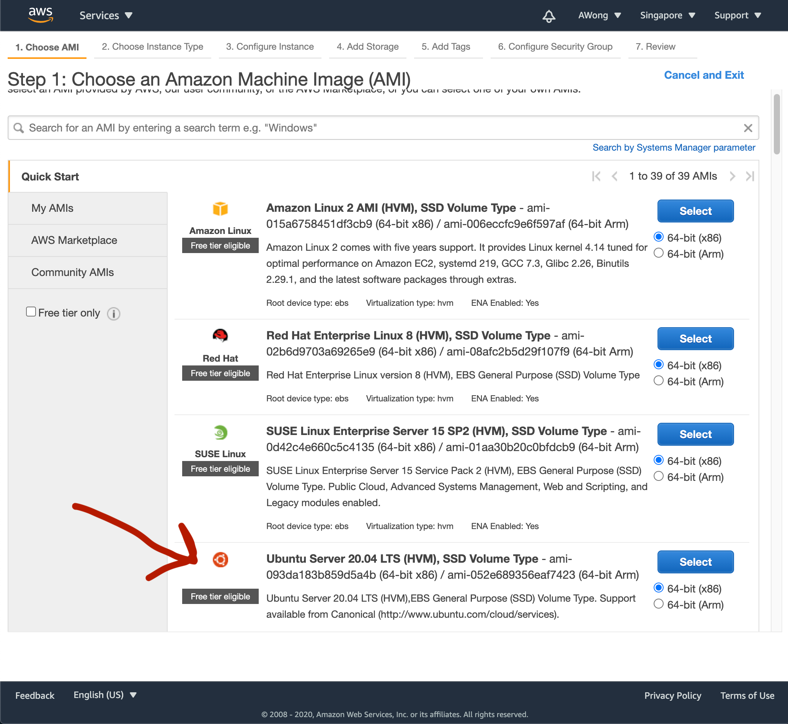
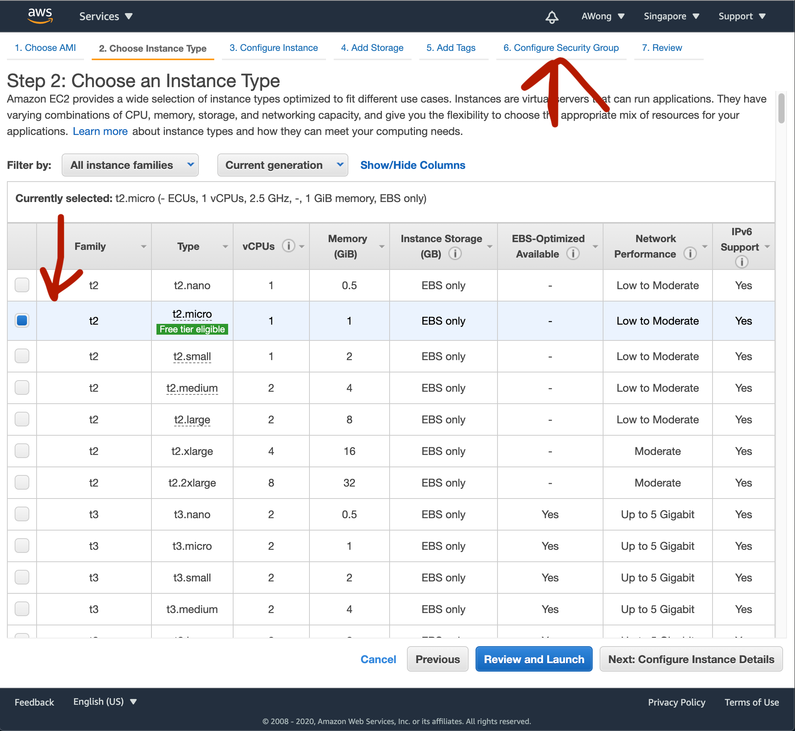
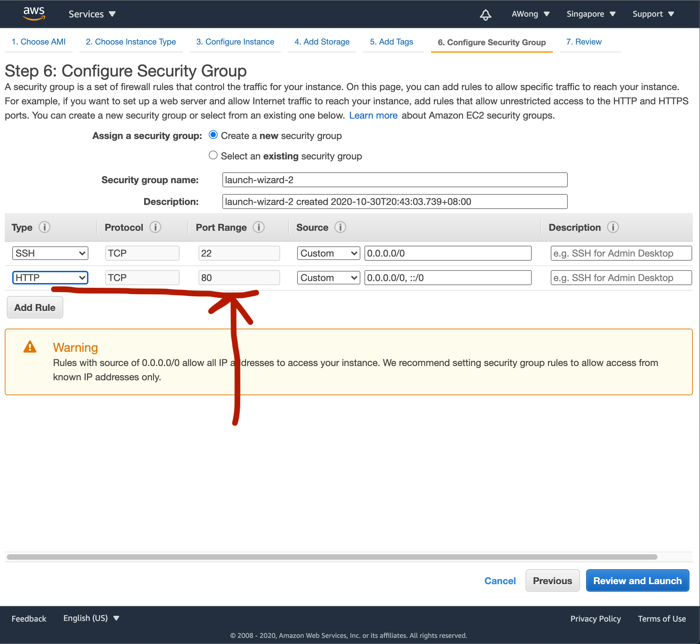
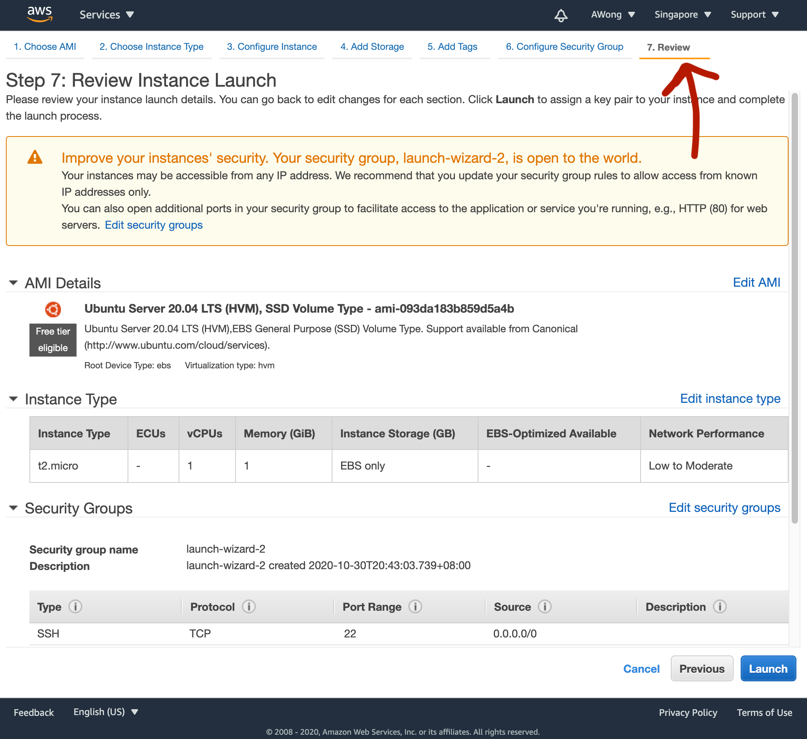
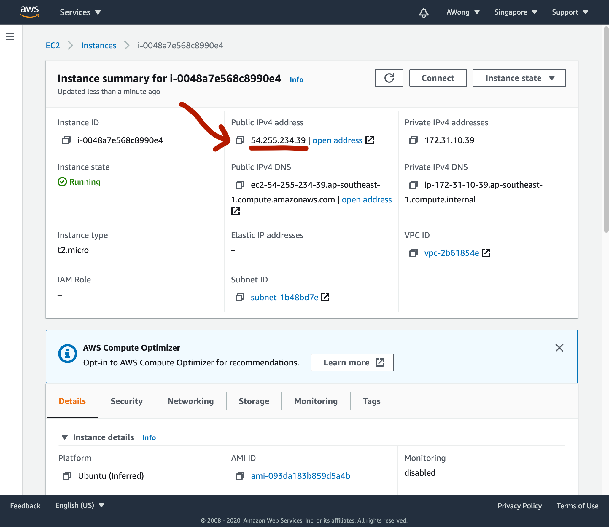

# 2.13: Deployment: AWS

AWS EC2 allows you to run code on a different computer.

## Create an AWS EC2 Instance

Log into AWS. This link assures that you are in the Singapore AWS region. [https://ap-southeast-1.console.aws.amazon.com/ec2a](https://ap-southeast-1.console.aws.amazon.com/ec2a)

Click the Launch Instance button.


Click to choose the Ubuntu version 20.04 AMI.



Make sure to select the free "micro" EC2 instance type.

Skip ahead by clicking to the Configure Security Group tab.



We want to change it to allow general public HTTP port 80 requests. Click the Add Rule button.


Select HTTP from the dropdown.


The default configuration will give you HTTP on port 80.



Click to Review and click the blue Launch button at the bottom.



AWS will bring up a modal and ask you about how you plan to access the instance.

Choose to create a new key, name it, and click the Download button.

After you've downloaded the key, click the Launch Instance button. There's no way to access the instance if you didn't download the key first.


You will be taken to the Instance Launching page. Click the link to your new instance.


Once you're on the instance list view click into your new instance.


The instance detail page will show you the public IP of your instance.



## SSH - Log In

Change the permissions of the key file to 400.

```text
chmod 400 path/to/filename
```

SSH into the instance.

```text
ssh -i /path/to/keyfile ubuntu@ec2-public-IP
```

[https://docs.aws.amazon.com/AWSEC2/latest/UserGuide/AccessingInstancesLinux.html](https://docs.aws.amazon.com/AWSEC2/latest/UserGuide/AccessingInstancesLinux.html)

## Install Node.js

```text
curl -sL https://deb.nodesource.com/setup_lts.x | sudo -E bash -
```

```text
sudo apt-get install -y nodejs
```

## Run a Server

Get the example server:

```text
git clone https://github.com/rocketacademy/file-server-example-swe1
```

```text
cd file-server-example-swe1
```

```text
sudo node index.html 80
```

Test it by requesting the server at your IP address. It should look something like: [http://54.255.234.39/index.html](http://54.255.234.39/index.html)

## Permanently Running Server

Run the node server in the bg:

```text
nohup sudo node index.js &
```

[https://linux.101hacks.com/unix/nohup-command/](https://linux.101hacks.com/unix/nohup-command/)

