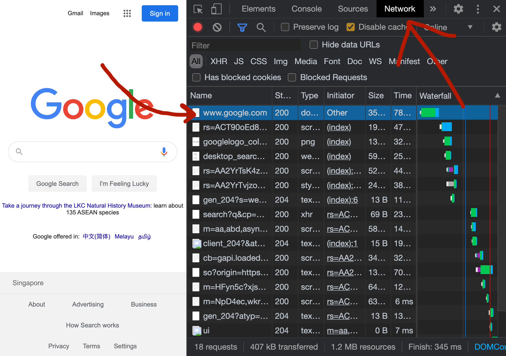

# 2.8: Chrome Networking

You've already been using network functionality of the browser without realizing it.

We're now ready to talk about an HTML file and how, in the real world, when you visit google.com, what is happening.

#### Basically every time you type a URL into the browser bar you are sending a request to be sent back an HTML file.

This mechanic is the basis of the system we are creating. Filling in these blanks about browser request behavior is one of the first steps in understanding what we are building.

## Network Tab

The Dev Tools networking tab is the part of the Dev Tools that can be used to analyze network requests.



Click on one of the items in the list of requests to see the detail view for that request.

Click on the response tab to see the raw response text.


## Browser Network Activity Types

### Typing in the address bar

When you type a host name into the address bar:

* A DNS request resolves your domain to an IP address.
* Chrome browser makes an HTTP GET request on port 80.

### HTML Tag Request Behavior

#### A script / link tag

```markup
<link rel="stylesheet" href="https://maxcdn.bootstrapcdn.com/bootstrap/3.3.7/css/bootstrap.min.css" >
<script src="https://maxcdn.bootstrapcdn.com/bootstrap/3.3.7/js/bootstrap.min.js" ></script>
```

When the browser sees this tag, it downloads a file to be parsed by other parts of the browser.

#### An img tag

```markup

```

When the browser sees this tag it downloads a file to be displayed within the page.

#### A link tag

```markup
<a href="http://www.google.com">google</a>
```

When the user clicks a link, the browser makes an HTTP method GET request to the address specified in the href attribute. Most of the time the response to this request is an HTML file that the browser will display on the screen.

#### A form tag

```markup
<form method="POST" action="http://google.com">
    <input type="text" name="name"/>
    <input type="submit"/>
</form>
```

When the user submits a form it creates a request, according to properties of the form. In this case an HTTP method POST request. \(We will dig more into this type of request later\).

## Exercise

Open the Chrome dev tools networking tab.

Write each of these tags in an HTML file and look in the network tab to see the request that gets created.

When the a tag link gets clicked, watch for the HTML code in the response to the request.

For the form, go to google.com homepage. Inspect the page to find the form for the search bar.

Look at the form and input elements.

Look at the request that happens when the form submits.

