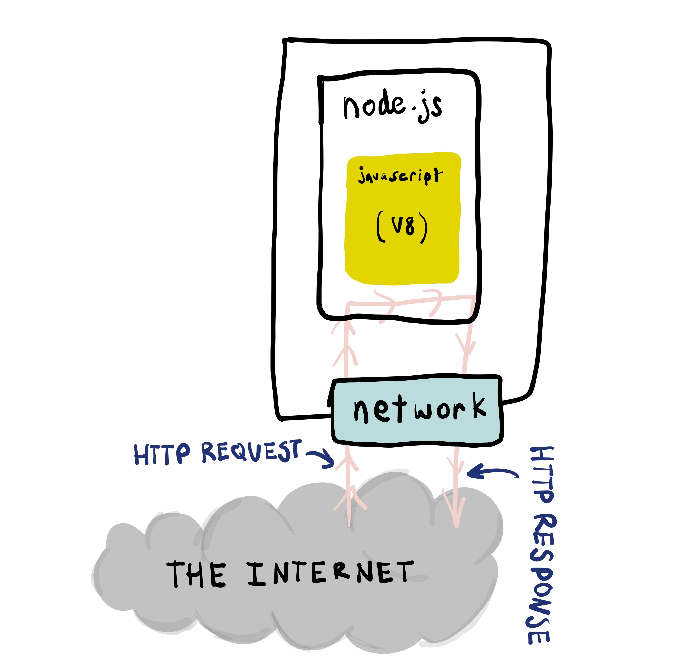

# 2.9: HTTP

When you interact with the internet:

1\) It's slow.

2\) You don't know how long it will take.


## HTTP

A way to send things over TCP/IP.

## Network Request to Yourself

### 127.0.0.1

There is a special IP address that doesn't access the network outside of the computer. It simply sends the request back around to the computer as if a request had come in from outside.

### localhost

localhost is the hostname that is resolved directly on your computer to 127.0.0.1


## What is a Server

[Wikipedia says](https://en.wikipedia.org/wiki/Server_%28computing%29) a server is: "_a piece of computer software that provides functionality for other programs called "clients"_."

We'll define a server as a program that listens for requests over the network.



## Server That Responds With 'yay'

#### index.js

```javascript
import { createServer } from 'http';

const PORT = 3004;

const whenIncomingRequest = (request, response) => {
  console.log('request came in');

  response.end('yay', 'utf-8');
};

createServer(whenIncomingRequest).listen(PORT);
```

After you run this file:

```javascript
node index.js
```

This server is available at: [http://localhost:3004](http://localhost:3004)

## HTTP Request Headers

Headers are meta information about a given request. 

### HTTP Method

The method indicates what kind of action the user is requesting the server do. The method is one of nine words that describes what kind of request is being made. The request method _is part of the javascript server application input_. It is up to you as the application programmer to decide which method most accurately describes the kind of request you are sending and accepting.

GET is the default method when you type into the browser bar. This method specification is sent in the header of the request.

GET means that you are _requesting to get something_. \(This language may seem redundant, but we'll see for the other methods, POST, PUT, DELETE, etc., that you can request to delete something\).

## HTTP Response Headers

### Status Code

The status code is the number that indicates what the server application says about the response. A status code _is part of the javascript application output_. It is up to you as the application programmer to decide which status code most accurately describes a given situation.

200 is the status code number that means everything was OK.

Use the method `writeHead` to set the status code of the response.

```javascript
response.writeHead(200, { 'Content-Type': 'text/plain' });
```

Look up[ in the docs](https://nodejs.org/api/http.html#http_response_writehead_statuscode_statusmessage_headers) for more on writeHead.

## Send Requests Out

### Send Requests with Chrome

Type in google.com to the address bar.

### Send HTTP Requests with the Command Line

```text
curl google.com
```

Learn more about curl here.

### Send Requests with Node.js

```javascript
import { get } from 'http';

const whenResponseRecieved =  (resp) => {
  let data = '';

  // A chunk of data has been recieved.
  resp.on('data', (chunk) => {
    data += chunk;
  });

  // The whole response has been received. Print out the result.
  resp.on('end', () => {
    console.log(JSON.parse(data).explanation);
  });
};

get('https://api.nasa.gov/planetary/apod?api_key=DEMO_KEY',whenResponseRecieved)
  .on("error", (err) => {
    console.log("Error: " + err.message);
  });
```

## Exercise

Clone [the base node repo.](https://github.com/rocketacademy/base-node-swe1)

Set up your server that listens for requests to come in.

Make a request to your server with each of the methods above.

Make a request to google with each of the methods above.

Make a request to: [https://api.nasa.gov/planetary/apod?api\_key=DEMO\_KEY](https://api.nasa.gov/planetary/apod?api_key=DEMO_KEY) with each of the methods above.

Use the Chrome networking tools and click into the request detail. Look for the header details of the HTTP method and status code.

Set your own header of: `rocket-academy-wow` and set the value to `true`.

Set other status codes in the header such as [206](https://developer.mozilla.org/en-US/docs/Web/HTTP/Status/206), [418](https://developer.mozilla.org/en-US/docs/Web/HTTP/Status/418) and [507](https://developer.mozilla.org/en-US/docs/Web/HTTP/Status/507). What do they do?

Set the special status code 300 like so:

```javascript
response.writeHead(301, { 'Location': 'http://google.com' });
```

What does it do? What does the network tab look like?

