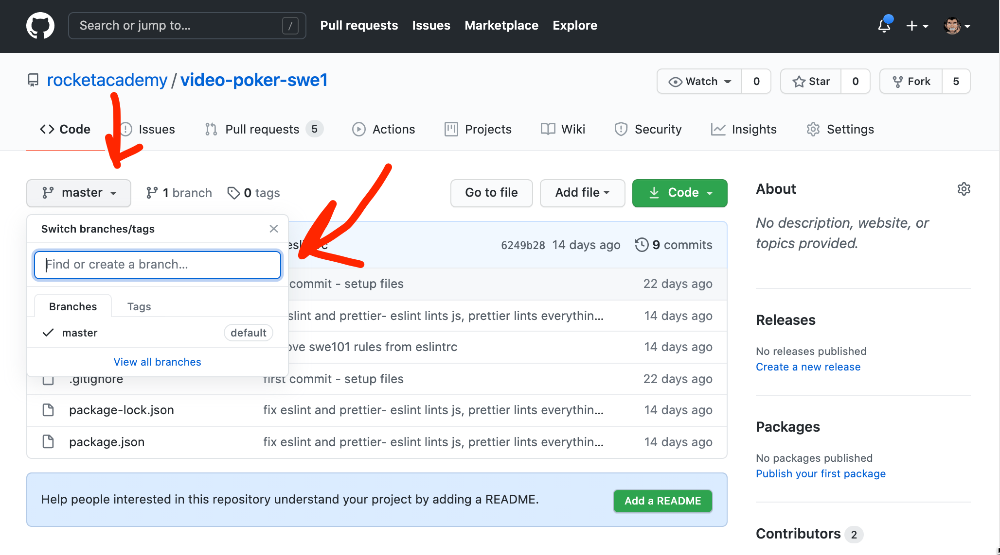

# 2.ICE.7: Git Branches

For this exercise we'll be creating a GitHub repo from scratch and creating branches for the repo.

## GitHub Repo Creation

Begin by creating a repo on GitHub.

When you create the repo also choose to create a README.md file as well, so that the repo does not start empty.

Clone the repo:

```text
git clone <URL OF REPO>
```

cd into the repo and add this JavaScript file.

#### index.js

```javascript
let name = process.argv[2];
console.log(`hello ${name.toUpperCase()} HOW ARRREEE YYYOOUUUUUU!??!?!?!`);
```

Add, commit and push this file to GitHub.

## Branch

Create a repo branch. Note that branch names are typically in kebab-case.

```bash
git checkout -b add-json
```

Add a `data.json` file and change the `index.js`

#### data.json

```javascript
{
    "names":[]
}
```

#### index.js

```javascript
import { writeFile } from 'fs';

let name = process.argv[2];

writeFile('data.json', name, error => console.log('err ->',error) )
```

## Push your changes to GitHub:

```javascript
git push origin add-json
```

Go to the GitHub website to see your changes. Use the branch dropdown:



## Main

Checkout the main branch again and make a change to `index.js` on line `2`:

```javascript
console.log(`good day ${name}, are you well?`);
```

Add, commit and push this change to GitHub.

## Pull Request

When you push to a branch you'll get  GitHub message asking you if you want to make a pull request.

You can click the green button to see a comparison against your main branch \(or any other branch\), and whether or not there will be any merge conflicts. \(Clicking won't actually create a pull request\).


## 2nd User Branch

Add your partner as a contributor to the repo:

Go to the settings tab of the 

* Go to the settings tab of the repo.
* Click **Manage Access** on the left side column menu.
* Click the green **Invite teams or people** button.


Type to autocomplete their GitHub username.


 They will receive an email with an invite to collaborate. \(This notification doesn't show up on the GitHub website\).

## Change Partner Repo

Once you are a collaborator, checkout the repo:

```text
git clone <URL OF REPO>
```

Create a new branch and make a change to line `2` of the  `index.js` file.

```javascript
console.log(`yo ${name}, what's up dude.`);
```

Add, commit and push this change.

## Team Work

When we begin to collaborate on code, a pull request is the main way we'll be able to control what is happening within a project.

Each team mate will create a branch for the feature they are working on and create a pull request when they are done with that feature.

Create a pull request with the changes you made on the branch.

