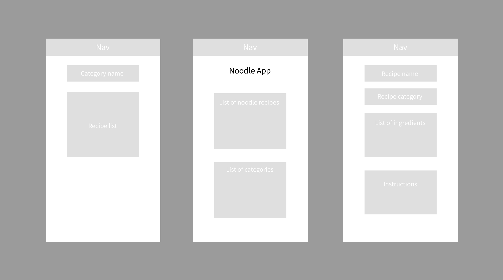

# 2.PCE.5: Noodle Website

## Noodle App CSS

Begin by forking [the repo.](https://github.com/rocketacademy/noodle-app-css)

Redo the [HTML noodle pages ](../../1-front-end-basics/1.pce-post-class-exercises/1.pce.1-noodles.md)as a responsive CSS / HTML set of pages according to the wireframes below. Choose your own color scheme of 2-3 colors. Use Bootstrap for the layout.

### Mobile Mockups

### Desktop Mockups

## Deploy to AWS

Use the [base file server repo application](https://github.com/rocketacademy/file-server-example-swe1) to serve files.

Inside this repo, clone your noodle app. \(This is an exception to the rule of not having repositories inside repositories\).

Your file server will then have access to the HTML  and CSS noodle app files inside of the folder.

You should be able to access your noodle website at something like: http://18.234.213.11/noode-app-css/index.html

Note that the way the file server app works, and the way this URL is formatted is that the URL path is the same as the noodle app directory name.

## Video Poker

Deploy the video poker game on the same AWS instance.

Follow the same instructions above as for the noodle app repo.

