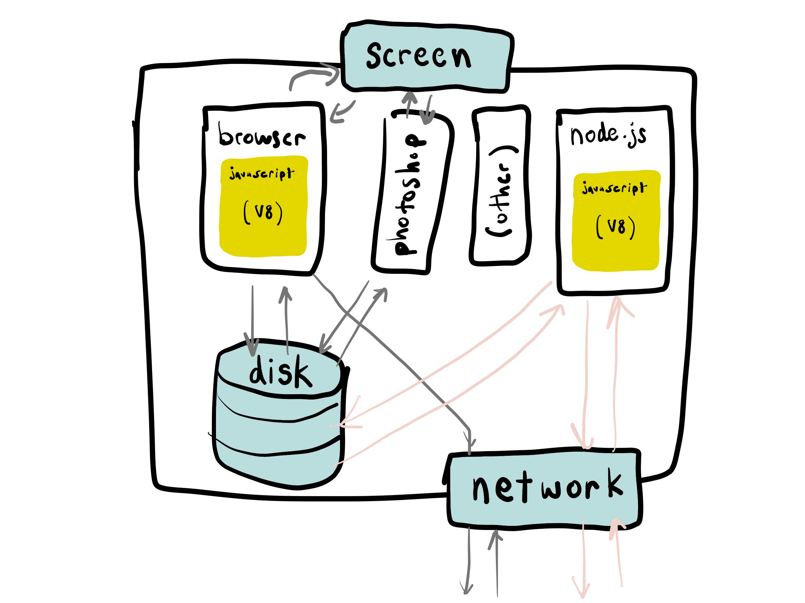

# 2.1: My First Node.js Program

## Introduction

We have seen the browser interact with several parts of our computers.

1. The computer display
2. The computer hard disk.
3. The internet, or the networking hardware of the computer.
4. Drivers receiving signals from keyboard and mouse hardware, playing sounds on speakers

We will now start to run JavaScript outside the browser, to interact more directly with our computers.

## What is Node.js

We are going to shift gears to run JavaScript in a new environment: Node.js. Node.js is a JavaScript runtime environment that runs directly on our computers and can interact directly with our computers. Node.js uses the [JavaScript V8 engine](https://en.wikipedia.org/wiki/V8_%28JavaScript_engine%29) used in Chrome, which was extracted to run independent of the browser environment.

Node.js is a popular backend framework because it enables developers to build both frontends and backends in JavaScript. This reduces friction for feature development, and has enabled a sizeable community of developers building libraries for JavaScript on both frontend and backend.

For the purposes of this course there are two important parts of the computer we want our Node.js programs to interact with:

1. The hard drive of the computer.
2. The networking hardware \(that is connected to the internet\).

Before we integrate these other aspects of the computer, first we are going to prove that we can run a whole complete JavaScript program directly on our computer.

## Computer Programs

Programs written to run directly on a computer use and have access to different parts of the system. Depending on what kind of program you are trying to create you might use a different language or library to work with the computer. Other languages or libraries give you useful tools and abstractions to build upon in your code.

Photoshop needs access to the hard drive and the screen. The browser needs access to the network and the screen. \(Although these very large programs use all of the functionalities of a computer, their main focus is around a few parts\).

Node.js is optimised for interacting with the hard drive and the networking hardware.



## Where We Are Going

We will use the Node.js environment to create "**application servers**_"_ that listen for incoming network requests from the Internet, save data onto a computer hard drive, and send back responses that can be HTML pages. We will learn how browsers use HTTP requests to retrieve HTML and trigger logic to manipulate data.


Note that the terms "disk", "hard drive", and "disk drive" are interchangeable for the purposes of Coding Bootcamp. This is the conceptual description of hardware that stores data that persists even after a computer is powered off.


## Javascript Development Console Environment

```bash
node
```

This takes you into an environment like the Dev Tools Console. Except that there are no files loaded or related to the environment.

Try typing some Javascript operations like:

```text
2 + 2
7 * 6
'hello' + 'world'
```

Type `Ctrl+C` to exit out.

## My First Node Program

Create a directory and put a single file inside.

```bash
mkdir my-first-node
cd my-first-node
touch index.js
```

Inside of `index.js`:

```javascript
console.log('hello');
```

Run the program:

```bash
node index.js
```

## Command Line Programs

The environment of the command line is just a way to interface with the operating system, and to run programs.

Just like the `git` command is an application we downloaded and installed on our computers, `node index.js` is a program that we created and will run on our computers just like anything else.

## Process

### What is a Process?

A process is an operating system representation of a single program. Each Chrome window is a process on your computer. Typically every single application or application part will have its own process.

When we run our Node.js programs they will also have their own process.

We can prove that this is true by typing `node` into the command line again. We will be able to see this program running on the computer.

Open the Task Manager \(Windows\) or Activity Monitor \(Mac\).

Look for or search for `node` and highlight the process. Type `Ctrl+C` in the command line. The process in the Task Manager / Activity Monitor will disappear.

### See Your Own Node.js program in the Activity Monitor

Normally your JavaScript runs so fast that you won't see the process begin and end in the Activity Monitor.

We can fix this by having the program run an artificially long time.

**index.js**

```javascript
let counter = 0;

while (true) {
  counter = counter + 1;
}
```

Now when we run this program from the command line it will continue to run forever until we kill it.

```bash
node index.js
```

Look for this process in your Activity Monitor. It should be taking up 100% of one core.

Type `Ctrl+C` to exit.

### `process` Variable

In the DOM - the other context of running JavaScript we saw before, the variables that _**represented**_ our running environment \(a browser window/tab\) were the two variables `window` and `document`.

To refresh on this concept, open any page in your Chrome browser and open the Dev Tools. Type `document` and `window` in the console.

For `window` click the triangle to see the keys inside this object. What are two keys that represent the state of the window or some data about the current page?

In Node.js we also have one variable that represents the environment our code is running in: `process`.

Create a new node program with one line:

```javascript
console.log(process);
```

Run it:

```bash
node index.js
```

Find some relevant keys in the `process` object.
