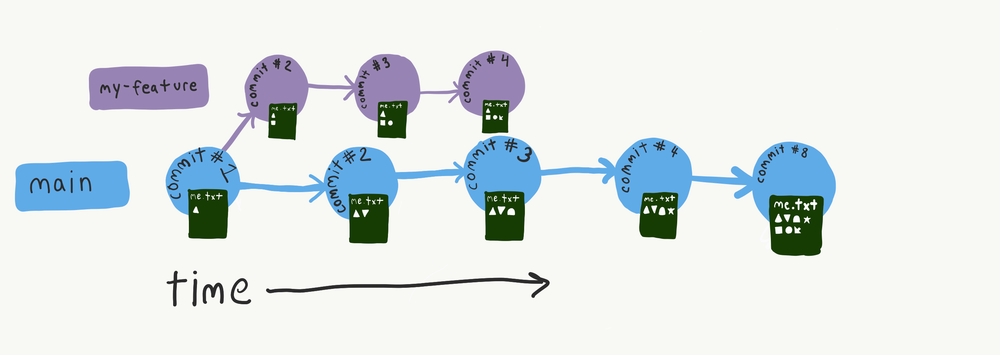
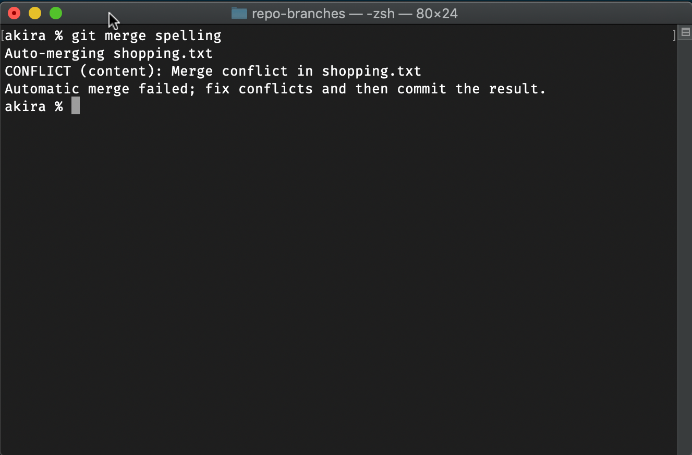

# 2.15: Git Branches

## Introduction

Git repos can consist of several parallel series of commits, called **branches**. This is helpful when there are multiple engineers working on the same repo, and each is working on their own feature, which may require 1 or more commits. Engineers develop features on their own "feature branches" so that they do not interfere with the development of other engineers. So far in SWE101 and SWE1, we have only been working on the `main` branch, but in practice we almost never want to be developing new features on the `main` branch, because the `main` branch is reserved for tested and approved code that is running in production. Once a developer has completed their new feature in their feature branch, they can **merge** their branch back into the `main` branch to "release" the feature to users.



## Create a New Branch

Create a new branch named "my-feature". You must not be in the middle of adding files to staging. `git checkout` is used to switch to or "check out" branches, and `-b` is a flag to create a new branch and check it out.

```text
git checkout -b my-feature
```

Check the name of your current branch:

```text
git status
```

Once you are in a branch you can make commits and the timeline of changes begins on that branch from the point you created that branch, and is independent of commits on any other branch.

## Using Branches

In a team setting, branches are used so that multiple people can work on a project at once. A new branch is created for each new feature of the software. The scope of what a branch contains is determined based on the engineering culture of a project.

For personal use branches can be used for several different reasons:

* To keep track of different sets of changes simultaneously.
* To try things out without copying files. \(And keeping a "safe" version in main branch\).
* To designate code for different features of your project.


Branch naming uses kebab-case if there is more than one word.


## Change Branch

You must not have any uncommitted changes to switch branches. \(You can create new branches with uncommitted changes\). Run `git checkout` without the `-b` flag to check out an existing branch.

```text
git checkout main
```

## Git Merge


After doing work in a separate branch, eventually you will want to have that work on the main branch. This is called a **merge**.

First_,_ make sure that you are _on the branch you want to merge into._

Run Git merge.

```text
git merge my-feature
```

Git will figure out how to put the two sets of changes together, and automatically create a "merge commit" to combine the changes from both branches.


Merges do not need to happen between a feature branch and main. They can be between any two branches. Often when developing on a feature branch, we will want to merge the main branch into our feature branch to verify whether our changes still work with the latest code on the main branch.

## Merge Conflicts

Git is not always smart enough to figure out how to arrange the contents of two different branches. If two branches change the same lines of the same files, there will be a "merge conflict". Merge conflicts are typically a result of miscommunication between team members, where both team members edit the same code in different ways at the same time.



`git status` shows which files have conflicts in them.

Once you have a merge conflict, you cannot commit or add files to staging or switch branches. You must resolve the conflict before you do anything else to the repo or to your code. \(If you don't want to resolve anything you can always abort the merge\).


Git tells you which specific lines it thinks are conflicting by using special characters:

This is the current latest commit in your repo. This set of changes begins here.

```text
<<<<<<< HEAD
```

The set of changes in HEAD ends with equals signs.

```text
=======
```

The set of changes in the spelling branch ends with these characters:

```text
>>>>>>> spelling
```

If you're not sure where in your file the merge conflict is, you can search in the file for these characters. VS Code will also highlight the sections of our file where there are merge conflicts, giving us convenient buttons to resolve the conflicts. 

Git doesn't know which lines you want to keep or get rid of. You have to decide what part of the file to keep.


Once you have fixed your files you need to add them to staging and `git commit` them. This will trigger Git to create the expected merge commit, with an auto-generated commit message. Don't write a commit message for this commit.

Note that Git doesn't actually know if you've fixed the files and taken out the special characters, it only knows that you have added the file\(s\). Just make sure to take out the special characters, or you'll get a syntax error!

## Exercise

Branching and merging without Conflicts

Create a new repo.

```text
mkdir poems
cd poems
git init
```

Create a poem about water in `water-poem.txt`. Commit this file to the repo.

Create and checkout a new branch so you can edit your water poem.

```text
git checkout -b water-poem-edits
```

Make a change to your water poem.

List all branches

```text
git branch 
```

Checkout the main branch again.

```text
git checkout main
```

Look at `water-poem.txt` to check that it has reverted back to this branches' version.

Create a new poem about sandwiches in a new file, and commit it.

Switch branches to your water poem branch.

```text
git checkout water-poem-edits
```

Look in the directory to see that the sandwich poem file does not exist in this branch. 

Checkout the main branch and merge your water poem edits in.

Check the `water-poem.txt` file to see your branch changes.

### Merge Conflicts

Make a new branch for edits to the sandwich poem.

```text
git checkout -b sando-poem-edits
```

Add a line to the poem and change the line that's currently there.

In order to create a merge conflict we must commit **new changes to the same lines** in the other branch.

Checkout the main branch.

Make a change to the sandwich poem and commit them.

Merge the branch into the main branch.

You will get a merge conflict.

Open the file to see the special characters git puts inside the file.

Resolve the conflict as shown above.

