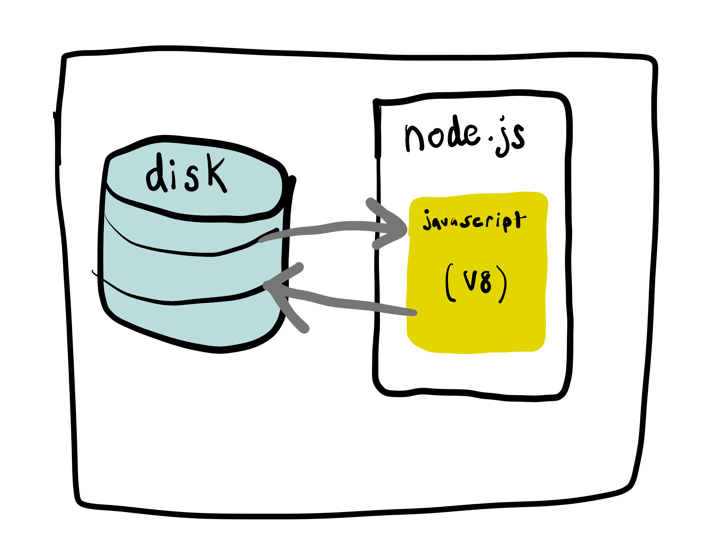

# 2.6: Altering Disk Files

## Introduction



In order to write a complete program that _**processes**_ a file, we need both file read and write. Appending to the end of a file can also be done with the [`fs.appendFile`](https://nodejs.org/api/fs.html#fs_fs_appendfile_path_data_options_callback) function.

We'll first read the file into our program, then write the final version back out. The following example uses a function `addToEndOfLine` to add a random number to the end of each line in a file.

```javascript
// get the node libraries
import { readFile, writeFile } from 'fs';

// set the name of the file we are working with
const filename = 'alter.txt';

// take a large string and breaks it apart into lines
// then add something to the end of each line
// return the altered text
const addToEndOfLine = (text) => {
  // split the text by newlines into an array where each element
  // is a new line of text.
  const lines = text.split('\n');

  let newContent = '';

  for (let i = 0; i < lines.length; i += 1) {
    // recreate in newContent the old content that's already there
    newContent += lines[i];

    // add a random number to the end of this line
    newContent += Math.random();
    newContent += '\n';
  }

  return newContent;
};

// set the file read callback
const whenFileIsRead = (error, content) => {
  console.log(content);

  // check for reading errors
  if (error) {
    console.log('reading error', error);
  }

  // call the text processing function
  const newContent = addToEndOfLine(content);

  // with the new content we got from
  // the function write out the result
  writeFile(filename, newContent, (err) => {
    if (err) {
      console.log('error writing', newContent, err);
    } else {
      // file written successfully
      console.log('success!');
    }
  });
};

// read the file
readFile(filename, 'utf-8', whenFileIsRead);
```

## Exercise

1. Clone [the base Node repo.](https://github.com/rocketacademy/base-node-bootcamp)
2. Create a file in the repo alter.txt with some sample content
3. Run the above code.
4. Open the file in VSCode to confirm its contents are the ones you specified in the JavaScript file.
