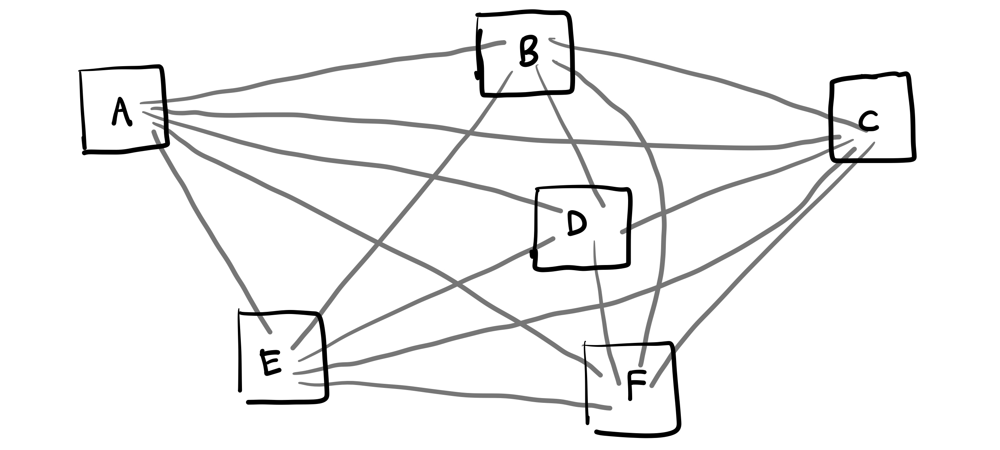
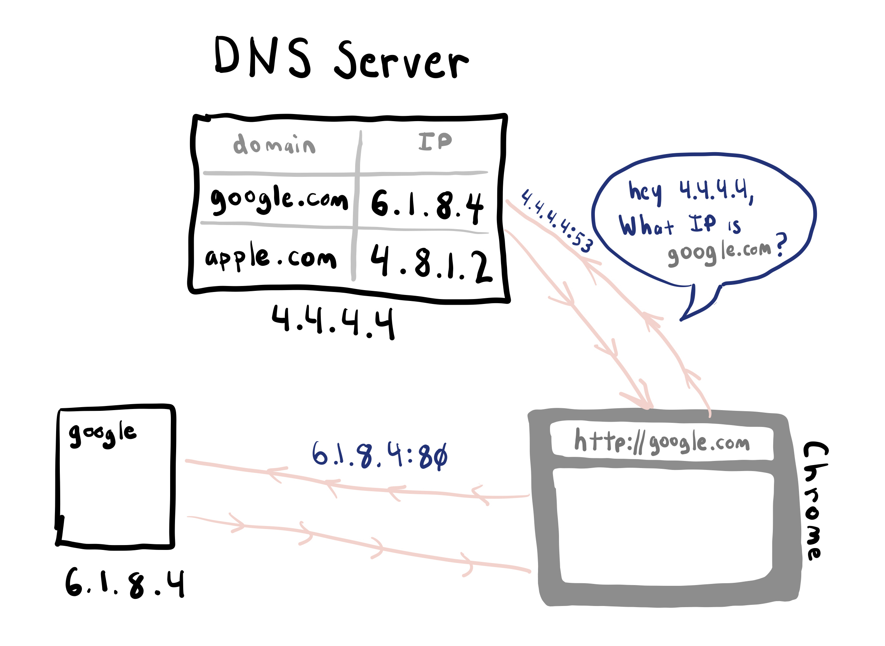
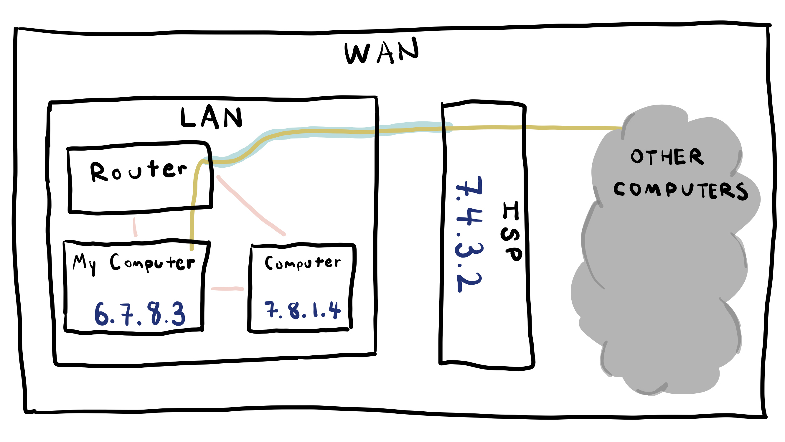

# 2.7: Internet 101

## Introduction


The Internet consists of the following 3 components.

1. Computers.
2. Physical infrastructure \(e.g. cables, modems, routers\) that connects these computers.
3. Software on the computers that enables communication across this physical infrastructure.

For RA's Bootcamp we'll focus on how to send and receive data across the Internet through Node.js. We will not delve too deep into the physical infrastructure or the networking software protocols used to connect computers. If you would like to read more about those topics, consider the [Further Reading](2.7-internet-101.md#further-reading) section at the bottom of this page.

The majority of computer networking happens at the operating system level, i.e. underneath our programs, which translates data from our apps to and from "packets" that can be sent across the Internet. Before we learn to send data across the Internet in JS \(which is relatively simple\), we'll learn some core concepts about how this data transfer happens.

## Networking Protocols

The Internet started as a small computer network where engineers designed "protocols" for computers to "talk" to each other. These protocols answered questions like the following.

1. What signals would the computers send?
2. How would these signals handle slow or unreliable connections?
3. What would happen when the receiving machine was turned off?

Networking protocols are rules for how computers talk to each other, implemented by the operating system so that any program can interface with the network. Files on our file systems work in a similar way, in that each operating system has rules for how it stores and manages files on the hard drive. When those rules are broken, files can become "corrupted" and un-openable. Similarly, when internet protocols are not followed, "packets" of data can become corrupted and un-readable.

## TCP/IP

There are multiple layers of protocols running on every computer to make apps like Chrome work. The lowest-level protocol we'll describe is **TCP/IP**, which stands for Transmission Control Protocol / Internet Protocol. This is the software that takes arbitrary data, splits it up into smaller, more manageable "packets", sends those packets across the network, and reconstructs them at the destination computer.

During RA's Bootcamp we won't interface with TCP/IP directly, but we will want to understand some key concepts that make TCP/IP work.

## IP Addresses



TCP/IP defines addresses for each computer on the network such that each computer can be reached by any other computer. These addresses are known as **IP addresses**. IP addresses typically look like this: `126.234.123.5`, 4 sets of numbers from 0-255 separated by full stops. These are known as IPv4 addresses.

There is a newer version of IP addresses [called IPv6](https://en.wikipedia.org/wiki/IPv6) with longer addresses and larger numbers. IPv6 addresses are less common today but will eventually become standard because IPv4 will not have enough addresses for all the computers on the Internet. IPv6 addresses look like this: `2001:db8:0:0:0:ff00:42:8329`.

In RA's Bootcamp and when building apps, we will mostly only work with IP addresses directly when configuring cloud infrastructure. In other situations when we access data across the Internet, we will use domain names like www.rocketacademy.co as more user-friendly proxies for IP addresses. We will learn how domain names translate to IP addresses and vice versa with DNS.

## Ports

On a given computer, many programs can be sending and receiving data across the Internet simultaneously, such as WhatsApp, Spotify, Windows Updates, Mac Updates, etc. When each computer only has 1 IP address, how does the operating system determine which data is for which application?

TCP/IP uses **ports** to determine which application receives which data. [Here](https://en.wikipedia.org/wiki/List_of_TCP_and_UDP_port_numbers) is a comprehensive list. Occasionally multiple applications will use the same port, in which case we may need to close the others for any to work. This is rare for popular applications. 

Ports are typically displayed as a number after IP addresses followed by a colon \(`:`\). We can use the following command to see all processes listening on specific ports on our computers.

```text
lsof -i -P -n | grep LISTEN
```


When building apps, the servers that we host on the Internet to manage data will use ports to "listen" for requests from our apps. These requests will be like "commands" that tell our servers how to handle data. The port number in a request will help the server computer decide which server app to send the request to. 

In the diagram above either the first \(port 3004\) or second \(port 80\) Node.js process.

## DNS

[DNS](https://en.wikipedia.org/wiki/Domain_Name_System) is a TCP/IP protocol that defines a way to identify the location of a computer on the network, but do it with words and not numbers. DNS is the system that translates domain names to IP addresses. DNS uses port 53.

The DNS system keeps a database of every domain name's IP address. When you enter in google.com into the browser, the browser has to look up the associated IP address so it can make the request to the correct computer.

Buy your own domain name [here](https://www.namecheap.com/promos/99-cent-domain-names).



Note that many times the browser will save, or "cache" these IP addresses so it doesn't have to look them up every time.

Use the command line to make this DNS request:

```text
host google.com
```

Notice that the result gives more than one answer. This is so that google can have many computers ready to respond to requests. If one fails, the browser will try another.

## HTTP

As you can tell by the name, HTTP \(Hyper Text Transfer Protocol\) was invented to transport HTML \(Hyper Text\) across the internet. Today the HTTP protocol is used for many other things besides HTML. HTTP uses port 80.

### Request / Response

For the purposes of this course one of the most important properties of the HTTP protocol is that it describes how data gets from one place to another.

The original concept of HTTP was that a person would want to view an HTML page on their browser, and so would request it by asking for a given HTML file at a certain IP address. The computer on the other end would receive the request and send back the HTML file as a response.

Today HTTP is used for many more things besides HTML pages, but the underlying request/response mechanic is still the same.

### Request and Response Everyday

Whenever a browser loads a page, the mechanic underlying this behaviour is request/response. First the browser has to make a request. This could be because the user made an action, such as clicking on a button, or it could be automatic, like your saved home page when the browser opens for the first time. The response will be an HTML page. That page is then rendered onto the screen.

Whenever one of these browser or user actions happens a whole request/response cycle must be completed before you see anything on the screen of the browser.

**This mechanic will form the basis of all the internet-connected programs we'll create for the rest of this course.**

## Other Protocols

There are still a bunch of surviving protocols built on top of TCP/IP like HTTP is. The most popular ones are:

**DHCP**: Used to configure your computer when it connects to a router. It uses port 67.

**SMTP**: This is the way most email is sent. It uses port 25.

_**Not used so much anymore:**_

**QOTD**: [Used to get a quote of the day.](https://en.wikipedia.org/wiki/QOTD) It uses port 17.

Try making a request to a quote of the day server from the terminal:

```text
telnet djxmmx.net 17
```

## URLs

URLs are the way to specify a particular resource on the internet.

```text
http://www.example.com/index.html?fruit=banana
```


### Protocol

http

### Host

www.example.com

#### Subdomain

www

#### Domain

example

#### Top Level Domain

com

### Path

index.html

### Query

fruit=banana

## WAN vs. LAN

When you are using the internet it may seem like your computer is on the internet. If that was true then it would have an IP address as described above. However, if that were true, your current IP address would be accessible by anyone on the internet.



### LAN

The architecture of the network you're currently connected to is almost certainly a LAN. or Local Area Network. This simply means that there is a smaller network that your computer is connected to that you can access the internet through.

Running `ifconfig` on your terminal will show the IP address currently assigned to your computer. If you are on Windows and running Ubuntu, you will need to [install `ifconfig`](http://geekstuff.org/2018/06/09/ifconfig-missing-in-ubuntu-18-04/#:~:text=You%20may%20install%20ifconfig%20utility,information%20about%20your%20network%20configuration.) before running it with `sudo apt install net-tools`.

```text
ifconfig
```

There will be many different "interfaces" listed, but the relevant one is usually called `en0`. This shows your current IP address on the LAN.


## WAN

We can also check to see what a computer on the internet thinks your IP address is. After all, when making a request to a server through the internet, that server will know things like where that request came from.

[https://whatismyipaddress.com/](https://whatismyipaddress.com/)

Notice that the two IP addresses are different. This is because the one printed out on your terminal is the one from the LAN. The one that is detected from your public internet request is the IP of some computer that belongs to your ISP, through which all of your traffic to the wider internet has been forwarded.

## Ping

[Ping](https://linux.die.net/man/8/ping) is a networking utility used to test if a computer is reachable on the network. It does not use a port because it is not trying to reach an application inside the computer, only that computer's networking software.

```text
ping google.com
```

Note that if you try ping different domains they take a different amount of time to respond, based on how far away the server is.

* ntu.edu.sg
* genting.com
* tigerbeer.com.sg
* stanford.edu
* nus.edu.sg
* in-n-out.com
* musee-orsay.fr
* rwandatel.rw

## Traceroute

[Traceroute](https://en.wikipedia.org/wiki/Traceroute) is a utility that diagnoses the computers your TCP/IP packets have travelled through.

```text
traceroute google.com
```

A visual traceroute can show you the various directions packets can take to get from point A to point B.

Try them with websites that are not global \(companies like google or apple will have servers located all around the world\).

Also note that these requests originate where the traceroute service is located- these are in Europe.

* ntu.edu.sg
* genting.com
* tigerbeer.com.sg
* stanford.edu
* nus.edu.sg
* in-n-out.com
* musee-orsay.fr
* rwandatel.rw





## Further Reading

1. See Stanford's [Intro to Networking course CS144](http://cs144.stanford.edu/) for further reading on these topics. [Here](https://www.youtube.com/playlist?list=PLEAYkSg4uSQ2dr0XO_Nwa5OcdEcaaELSG) is a playlist of past CS144 videos that past Coding Bootcamp students have found helpful.
2. Past students have found [this video](https://www.youtube.com/watch?v=RDotMcs0Erg) helpful in introducing ports and how they are used.

