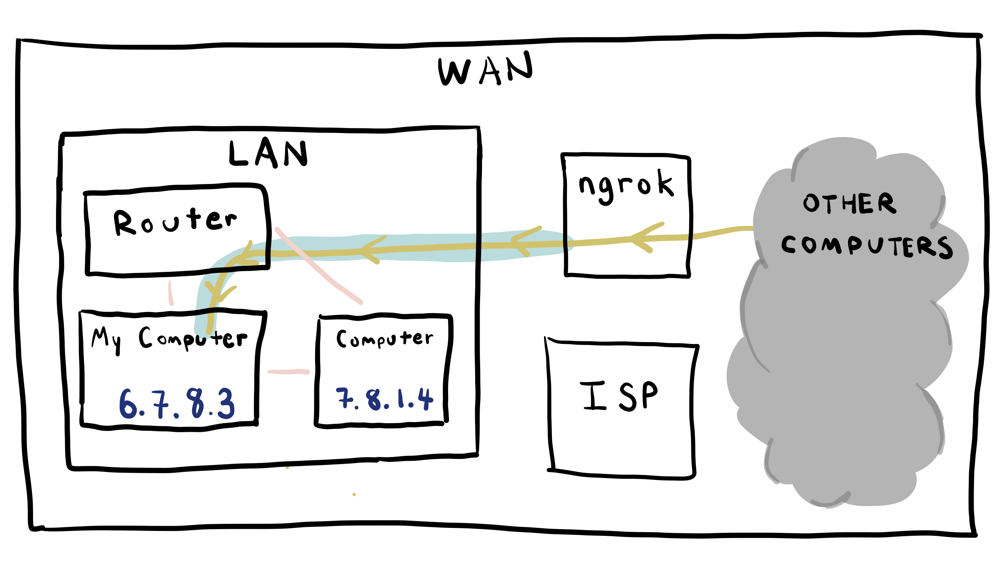
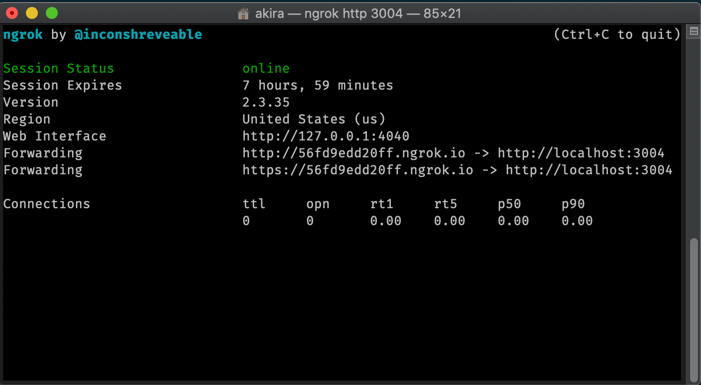

# 2.ICE.4: Internet

## Setup

Start with the [base Node repo](https://github.com/rocketacademy/base-node-bootcamp).

## Make Requests

### index.js

```javascript
import { createServer } from 'http';

const PORT = 3004;

const handleIncomingRequest = (request, response) => {
  console.log('request came in');

  response.end('yay', 'utf-8');
};

createServer(handleIncomingRequest).listen(PORT);
```

Open a new terminal and start your server:

```text
node index.js
```

## ngrok



ngrok is a service that puts your computer on the real internet by circumventing your LAN. With a LAN you can never receive any requests from outside your local network.

We'll use ngrok to be able to accept requests from the real world. ngrok works by forwarding any request to their special address right to your computer at the port of your choosing.

Install [ngrok](https://ngrok.com/).

\(Note you don't need to sign up for their service or pay anything\).

Mac

```javascript
brew cask install ngrok
```

Windows

```text
sudo apt-get install ngrok-client
```

Start ngrok to send HTTP traffic to port 3004.

```text
ngrok http 3004
```



The terminal window will show you the URL that is currently designated for your computer.

Now, open a new terminal window. _You must keep the ngrok window open._

Alter the code to the [base HTTP server](../2.9-http.md#server-that-responds-with-yay) to give a special message to anyone who requests it.

Put the URL to your server in Slack.

## File Server

Use the [base file server code](../2.10-http-file-server.md) and serve your [poker game project](../../projects/project-1-video-poker.md) instead of a message.

Use the file server to serve the [Bootstrap HTML files you created in the previous exercise.](2.ice.3-disk-altering.md#html-processor)

Use the file server to serve any other files you want.

## Multiple Servers

Change the code of the original \(non-file\) server from port 3004 to port 3008.

Open a new terminal window and run it.

Open another, fourth terminal window and run another `ngrok`.

Post this server in Slack.

## Make requests

Just like the previous exercise, make a request to the servers others have posted in Slack.

Use:

* `curl`
* the browser
* Node.js' `http.get`

Verify that you are able to access others' servers exposed via `ngrok`. Do you notice any differences between responses from others' servers and your own?

