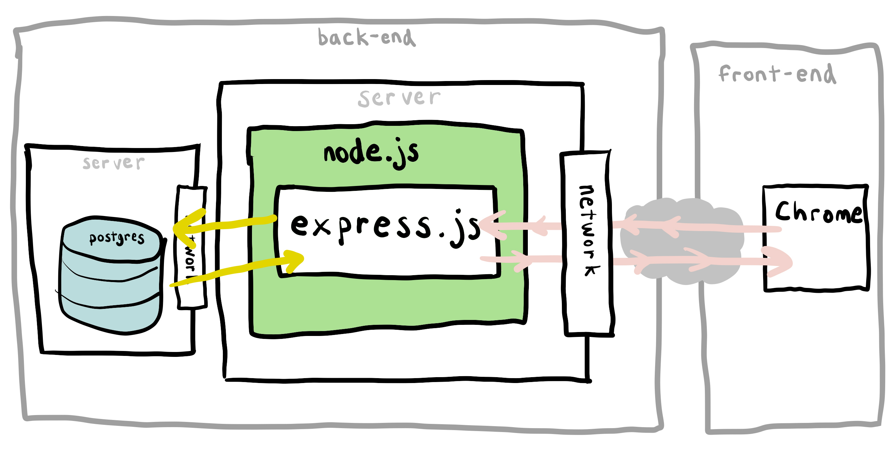

# 3.0: Module 3 Overview

## **Complete Backend App with PostgreSQL**

Express.js is the NPM HTTP library we'll be using to construct our web applications. We'll be learning how to build dynamic applications with it and storing data in a SQL database.

## Architecture 

In this module we'll officially define the back-end and front-end portions of our app architecture:

### Front End

The front end is where the user actions occur. For the purposes of this module these actions are represented by requests that are generated at the front end and are sent to the back end.

The front end, specifically the browser application is the thing that sends requests out and receives and renders the response to the request. In this module the response mostly refers to HTML.

### Back End

The back end listens for incoming user actions \(in the form of a request\). When it receives a request it runs some JavaScript logic to determine what response to send back.

Thus far, the logic in our file server was limited to responding if the file specified in the URL path was a file that existed in that computer's file system.

We'll grow out the logic of our back end to be the main logic of our application.

## Bigger Picture

In fact, for any given architecture for an app we can define a front-end and a back-end. We'll see later on that we can define a back-end portion of our front-end \(React\) app called Redux. We'll see that the database server behind our back-end Express.js server could be considered a back-end to the back-end.

In web programming the term front-end normally refers to the browser, and the term back-end normally refers to the server receiving the browser's requests, although these are not fixed terms.

## What we're building

This module is about defining the specific mechanics of requests that move from our browser to the back-end, and given some UI design standards, what the user would expect to see as a result of the request.

We are extending the capabilities of the Noodle HTML / CSS file server app, so that we can represent the fundamental data in the noodle app HTML in a different format. \(First JSON, then SQL\).

This gives us the power to build an application in which the JavaScript representation of that data gives us tools to manipulate it an apply logic to it. This data will be dynamic and extensible and the applications' user will be able to see and change it according to the rules and logic of our app.

Remember that building the Tic Tac Toe game relied on a specific implementation of the data- the board- as a 2-dimensional array. Here we are also concerned with making sure that our data is properly formatted so that we can use and manipulate it later.

The fundamental power of a web application is surfacing pure data \(JSON or SQL\) in an HTML format inside the browser.

