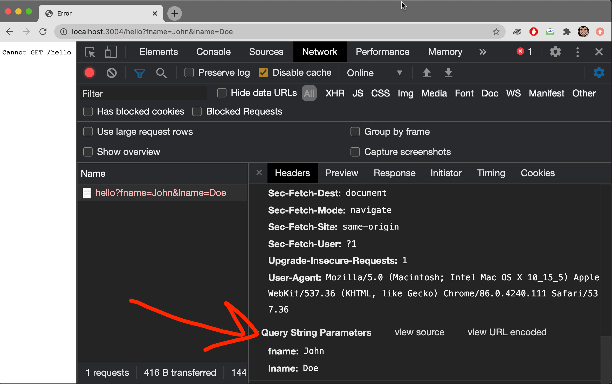
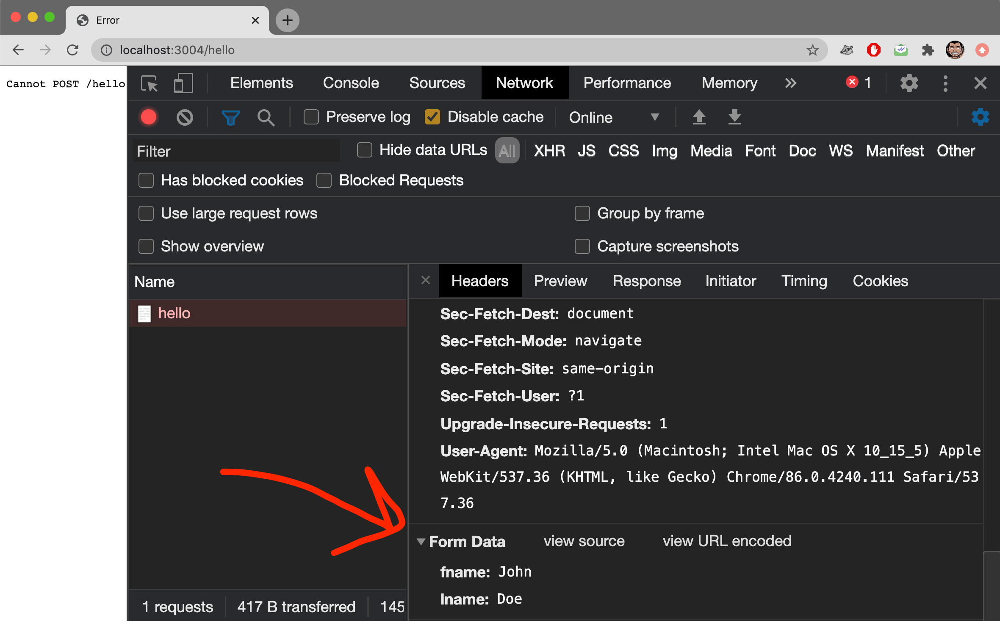

# 3.1.2: HTML Forms

## Introduction

When talking about HTML request behaviour in [Module 2.8: Chrome Networking](../../2-back-end-basics/2.8-chrome-networking.md#html-tag-request-behavior) we said `form` elements are one type of HTML tag that generates requests. In web applications, forms are used to send data to the server. Note there are other ways to send data through requests \(like in the URL path\), but best practice is to send data via forms. The most famous form is the search bar form on the [Google homepage.](https://google.com)

## Form Request

Render this HTML and click Submit. The form action is the destination URL path to send a request to on form submit. Unless otherwise specified, forms send GET requests.

```markup
<form action="/hello">
  <label for="fname">First name:</label><br>
  <input type="text" id="fname" name="fname" value="John"><br>
  <label for="lname">Last name:</label><br>
  <input type="text" id="lname" name="lname" value="Doe"><br><br>
  <input type="submit" value="Submit">
</form> 
```

Chrome DevTools displays the parameters of the request in the request headers view.



## HTTP Method

We will first use forms to create data that persists on disk until explicitly deleted. We will persist the data in a JSON file. We will use form inputs to collect the data that will go in the JSON file. POST is the designated HTTP method that signifies a request to create new data in the database. We can set the method of a form with the `method` attribute.

```markup
<form action="/hello" method="POST">
```

Make the above change to the form and see the request change. The heading containing the request parameters changes to Form Data. There are also no more query parameters in the URL because we made the request use the POST method instead of the default GET method.



Form Data is sent as part of the request body, and is a special kind of data sent in HTTP requests because it can contain data like files. Request headers are typically used to store request metadata such as user agent and authentication data, and the request body is typically used to store data relevant to business logic, such as uploaded files.

Notice in Form Data the `fname` attribute key is bold, and the attribute value is the information typed into the form corresponding to the `fname` attribute.

