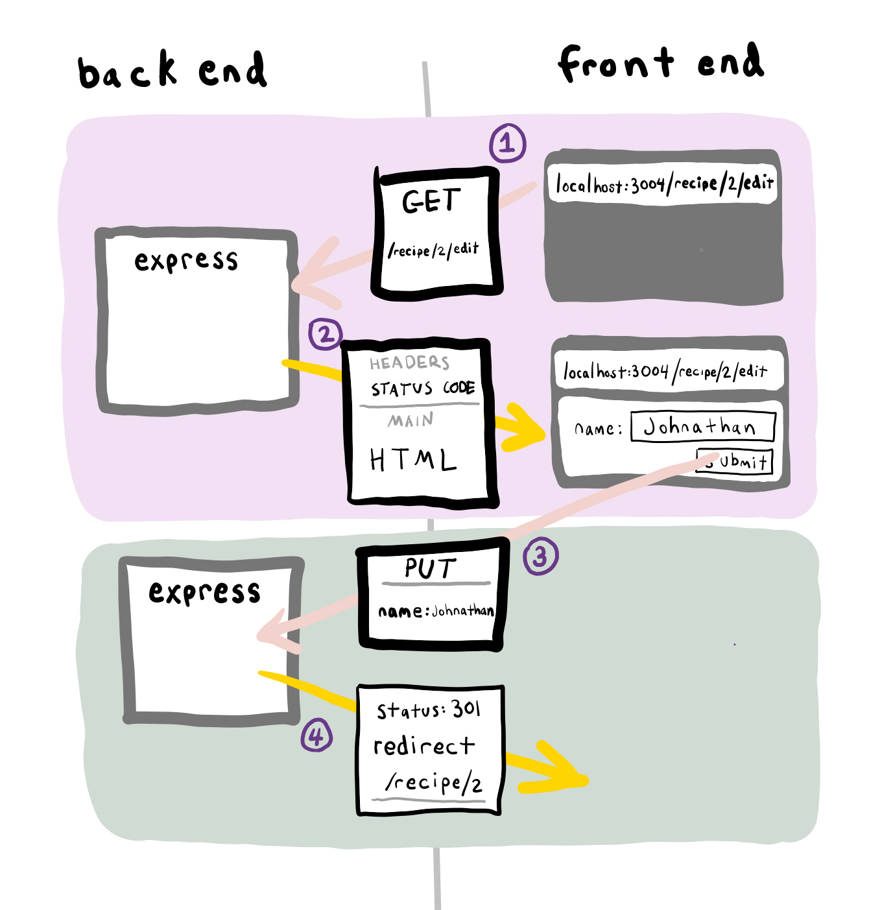

# 3.1.4: PUT/DELETE

GET, POST, PUT, and DELETE are 4 of the most common HTTP methods on the internet, corresponding to the 4 core operations of most applications today. These operations are often referred to as CRUD \(Create, Retrieve, Update, and Delete\), and most applications today are CRUD applications. This is in contrast to more sophisticated applications that might involved advanced technologies or algorithms such as the Blockchain or Machine Learning.

## PUT

The next thing to add to add to our app is the ability to edit the data that's already there.

There are two specific HTTP methods for this, PUT and DELETE. DELETE is straightforward, PUT signifies a request to edit something.

### Route

```javascript
app.put(<PATH>, <CALLBACK>);
```

The route for PUT is distinct because we have added the `index` request parameter. This is because if we want to edit something, we need to specify in the request _which_ thing to edit.

```javascript
app.put('/recipe/:index', function (request, response) {
  const { index } = request.params;

  read('data.json', (data) => {
    // completely replace the obj here
    data['recipes'][index] = request.body;

    write('data.json', data, (doneData) => {
      response.send('done!');
    });
  });
});
```

When we receive the request we will simply replace all of the data that's currently saved for that recipe and replace it with what's in the request.

Make the PUT request with `curl`:

```markup
curl -X PUT -d banana=apple localhost:3004/recipe/1
```

Look inside the data.json file to confirm changes have been made.

### Method Override

For some unclear reason, browsers are not able to produce a request with method PUT. We still want to be able to write `app.put` in express so we can use library so that if we pass a special query param, Express.js will still call the correct callback.

Install the package:

```markup
npm install method-override
```

Put the configs in the `index.js` file:

```javascript
import methodOverride from 'method-override';

// override with POST having ?_method=PUT
app.use(methodOverride('_method'));
```

Add a query parameter to the end of the action:

Add a hidden form field param to pass into the package. It is watching for incoming requests with this param.

```markup
/recipe/1?_method=PUT
```

See more about method-override here:

\[[https://dev.to/moz5691/method-override-for-put-and-delete-in-html-3fp2\#:~:text=Browsers](https://dev.to/moz5691/method-override-for-put-and-delete-in-html-3fp2#:~:text=Browsers) do support PUT and,supported by 'HTML form\]\([https://dev.to/moz5691/method-override-for-put-and-delete-in-html-3fp2\]%28https://dev.to/moz5691/method-override-for-put-and-delete-in-html-3fp2\]%28https://dev.to/moz5691/method-override-for-put-and-delete-in-html-3fp2\#:~:text=Browsers do support PUT and,supported by 'HTML form](https://dev.to/moz5691/method-override-for-put-and-delete-in-html-3fp2]%28https://dev.to/moz5691/method-override-for-put-and-delete-in-html-3fp2]%28https://dev.to/moz5691/method-override-for-put-and-delete-in-html-3fp2#:~:text=Browsers%20do%20support%20PUT%20and,supported%20by%20'HTML%20form)\)

[http://expressjs.com/en/resources/middleware/method-override.html](http://expressjs.com/en/resources/middleware/method-override.html)

[https://softwareengineering.stackexchange.com/questions/114156/why-are-there-are-no-put-and-delete-methods-on-html-forms](https://softwareengineering.stackexchange.com/questions/114156/why-are-there-are-no-put-and-delete-methods-on-html-forms)

### PUT Form

We need a GET route to render the form that will create the request to our route above.

```javascript
app.get('/putform', (request, response) => {
  response.render('edit');
});
```

#### edit.ejs

```markup
<html>
  <body>
    <form action="/recipe/<%= recipe.index %>?_method=PUT" method="POST">
      <label for="label">recipe label:</label><br />
      <input type="text" id="label" name="label" /><br />
      <label for="ingredients">ingredients:</label><br />
      <input type="text" id="ingredients" name="ingredients" /><br />
      <input type="submit" value="Submit" />
    </form>
  </body>
</html>
```

### Previous Data

After making the route work, one specific optimization we need to make to the system is to, before the user submits new information, show them the old / current data.

This means we need to render a form that already has the current info in it.

The path shown below is the proper edit URL path.

```javascript
app.get('/recipe/:index/edit', (request, response) => {
  console.log('request came in');

  // read the JSON file
  read('data.json', (data) => {
    console.log('done with reading');

    // get the index param
    const { index } = request.params;

    // get out the recipe
    const recipe = data.recipes[index];
    recipe.index = index;
    const data = { recipe };

    // render the form, pass in the recipe
    response.render('edit', recipe);
  });
});
```

#### edit.ejs

We use EJS to pre-populate our form with the current recipe data. Line 6 and 13 we set the value of the form to the data we passed inside the route.

```markup
<label for="label">recipe label:</label><br />
<input type="text" id="label" name="label" value="<%= recipe.label %>" /><br />
<label for="ingredients">ingredients:</label><br />
<input
  type="text"
  id="ingredients"
  name="ingredients"
  value="<%= recipe.ingredients %>"
/>
```

## PUT Request Flow



This series of requests needs to happen in 2 stages.

**Render the form.**

1\) The browser makes a GET request to render the form. The request passes the index of the recipe it wants to edit. Express looks in the JSON file to find the recipe and populates the values into the form, and sends it back.

2\) The form, with that recipe's current values are rendered into the browser.

**Submit the form.**

Note that we also made this request with `curl` above.

3\) The user clicks the submit button of the form. It goes to `/recipe/2`. The place where the request goes to has already been set by the HTML- the `action` attribute of the form. We already knew how to set the action in **2** given the index parameter from **1**.

4\) The response is sent back to the browser. A typical response would be a redirect to `/recipe/2`. Not shown is the other GET request that would produce.

## DELETE

Delete does exactly what it says- it takes an element out of the array. We are using `splice` for this.

```javascript
app.delete('/recipe/:index', (request, response) => {
  const { index } = request.params;

  read('data.json', (data) => {
    // take a thing out of the array
    data['recipes'].splice(index, 1);

    write('data.json', data, (doneData) => {
      response.send('done!');
    });
  });
});
```

#### DELETE Form

We don't need any information to do a DELETE, only the index of the thing we want to delete. For this reason, DELETE forms don't often merit their own separate form pages. This form would normally go somewhere that is related to this recipe, like `/` or `/recipe/:index`.

#### delete.ejs

```markup
<form action="/recipe/<%= index %>?_method=DELETE" method="POST">
  <input type="submit" value="Submit" />
</form>
```

