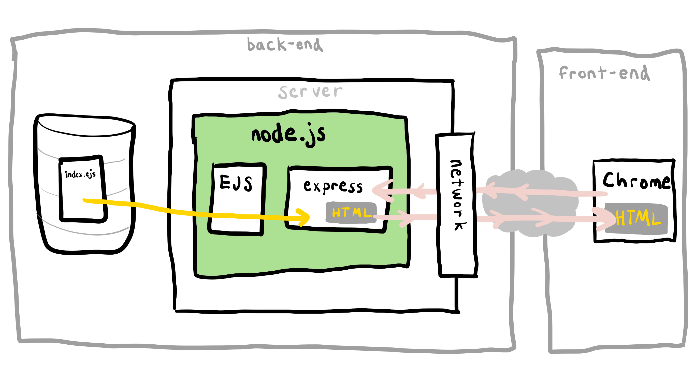
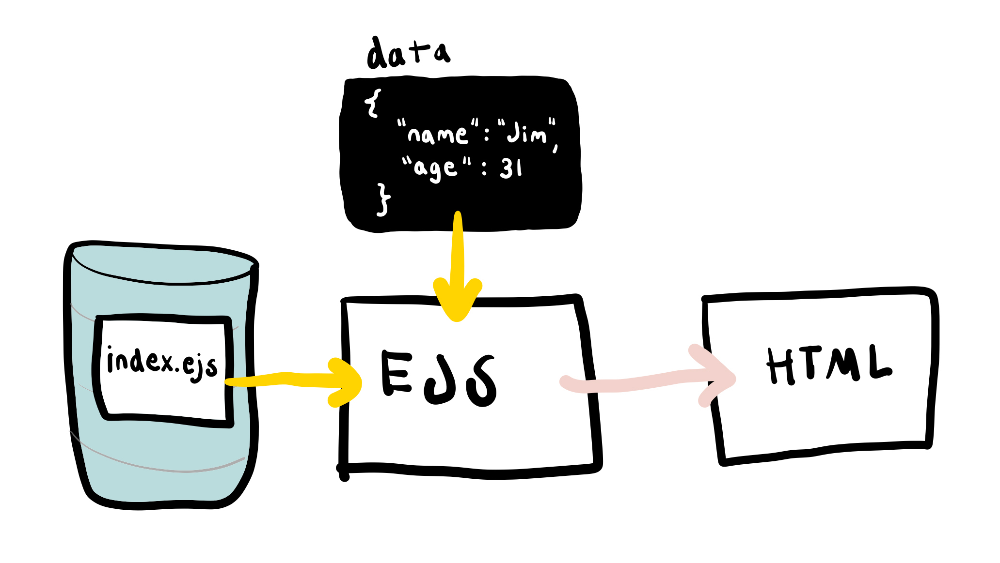

# 3.3: Intro to EJS



EJS is the npm library that works together with Express.js so that our responses can be full HTML documents.

It uses EJS HTML template files so that the main part of the HTML document does not have to be rewritten for every kind of response.

Express.js' `render` function runs the EJS part of the system and produces an HTML string that is sent back to the browser.

We are beginning to split our app up into separate files by putting the response HTML templates in their own directory.

### Views

EJS takes data passed to it from the `render` function and uses that to produce the HTML that gets sent back. These files will all live in a directory called `views`. The term "view" comes from the [Model-View-Controller or MVC framework](https://en.wikipedia.org/wiki/Model%E2%80%93view%E2%80%93controller) that defines views as the looks of the application, i.e. what the user is able to "view".



## Using EJS

#### Configuration

Install the EJS library:

```sh
npm install ejs
```

Set the library for all requests. This line goes below where you define `app`, but above any routes.

```js
app.set('view engine', 'ejs');
```

#### Banana App File Structure

```text
└── bananas-app
    ├── index.js
    └── views
       └── index.ejs
```

`response.render` takes two arguments.

1. The path/name of a file \(without extension\) in the `views` directory.
2. Data that will be used to render the HTML. This is an object.

#### index.js

```javascript
app.get('/bananas', (request, response) => {
  const data = {
    user: {
      name: 'kai',
    },
  };

  response.render('index', data);
});
```

#### index.ejs

```markup
<html>
    <body>
        <h2><%= user.name %></h2>
    </body>
</html>
```

Install the EJS syntax highlighter for VSCode: [https://marketplace.visualstudio.com/items?itemName=DigitalBrainstem.javascript-ejs-support](https://marketplace.visualstudio.com/items?itemName=DigitalBrainstem.javascript-ejs-support)

## Exercise

Run the above code.

Write an `h1` element and fill it with another key in the `data` object.

Create a request param: `/fruits/:name`. In the route callback get a hold of the value and output that request value in the HTML by adding it to the data object, then referencing it in the HTML.
