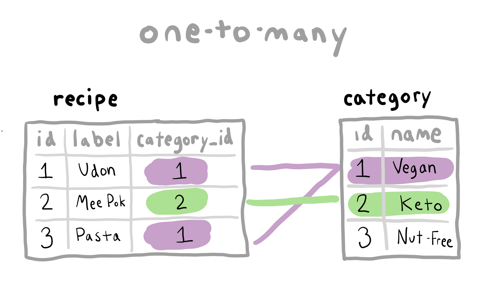

# 3.4.2: SQL Relationships \(One to Many\)



In SQL we can create a relationship between two tables by referencing the primary key of one table in another column on a different table.

In this example we are giving each recipe a category. The name of the category is stored on a different table.

The udon recipe is vegan, the pasta recipe is vegan and the mee pok recipe is keto. Another way to phrase it would be that the vegan recipes are udon and pasta, and the keto recipe is mee pok. THe relationship is called one-to-many because a recipe has one category and a category has many recipes.

At first this may seem less efficient than simply putting the name of the category into the recipe table \(like we had in the noodle recipe JSON\). But with SQL we can structure our data much more strictly.

```text
"recipes":[
    {
        "label":"Udon",
        "category":"vegan"
    },
    {
        "label":"Mee Pok",
        "category":"banana"
    }
]
```

In our JSON recipe app we had a category structure that was _implicit_. That is to say, that we didn't have anything in the JSON file that said which categories exist. Now, with SQL and this specific relationship we are trying to make sure that there are a set number of categories and a recipe can only have a category that already exists.

### Foreign Keys

The term foreign key specifically means that we hold the value of a primary key in a different column in another table, and that the column \(in this case, `category_id`\) is the reference to that row \(in this case a row in `categories` table\).


There is also a Postgres data type called foreign key, but we won't be using this in our apps. This Postgres foreign key refers to a database application server feature that gives errors if the rules described above are violated.


### Example

```text
CREATE TABLE recipes ( id SERIAL PRIMARY KEY,
                 label TEXT,
                 category_id INTEGER);

CREATE TABLE categories ( id SERIAL PRIMARY KEY,
                   name TEXT);
```

Create some records:

```text
INSERT INTO categories ( name ) VALUES ('vegan');
INSERT INTO categories ( name ) VALUES ('keto');
INSERT INTO categories ( name ) VALUES ('nut free');
```

Check which ids have been assigned:

```text
SELECT * FROM categories;
```

Associate and create some recipes:

```text
INSERT INTO recipes ( label, category_id ) VALUES ('Udon',1);
INSERT INTO recipes ( label, category_id ) VALUES ('Mee Pok',2);
INSERT INTO recipes ( label, category_id ) VALUES ('Pasta',1);
```

Get all the vegan recipes:

```text
SELECT * FROM recipes WHERE category_id=1;
```

Get the name of the category of the udon recipe:

```text
SELECT * FROM categories WHERE id=1;
```

