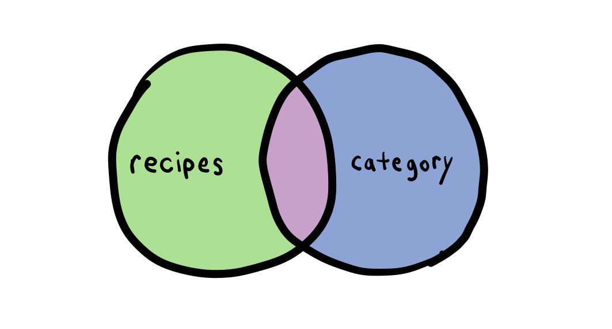

# 3.4.4: Inner Join

## Introduction



The `INNER JOIN` keyword selects records that have matching values in both tables. We will see examples of this in this module.

## Setup

To follow along with the queries in this module, set up `recipes` and `categories` tables as per the following.

Create `recipes` and `categories` tables. Note that the foreign key `category_id` is in the `recipes` table because each category can have many recipes but each recipe can only have 1 category. If we wanted the foreign key in the `categories` table, we would need to store an array of `recipe_id`s in `categories`, which violates our SQL rule of no data structures in table cells.

```sql
CREATE TABLE recipes (id SERIAL PRIMARY KEY, label TEXT, category_id INTEGER);
CREATE TABLE categories (id SERIAL PRIMARY KEY, name TEXT);
```

Create category records:

```sql
INSERT INTO categories (name) VALUES ('vegan');
INSERT INTO categories (name) VALUES ('keto');
INSERT INTO categories (name) VALUES ('nut free');
```

Check which IDs have been assigned:

```sql
SELECT * FROM categories;
```

Associate and create some recipes:

```sql
INSERT INTO recipes (label, category_id) VALUES ('Udon', 1);
INSERT INTO recipes (label, category_id) VALUES ('Mee Pok', 2);
INSERT INTO recipes (label, category_id) VALUES ('Pasta', 1);
```

## Sample Queries

### Inner Join on ID

This query gets specific columns from the `recipes` and `categories` tables where `categories.id` is the same as `recipes.category_id`. Note the format of &lt;TABLE\_NAME&gt;.&lt;COLUMN\_NAME&gt; to reference columns in a specific table. To use this naming format, the relevant tables need to be reference either in the `FROM` or `JOIN` sections of the SQL query.

```sql
 SELECT recipes.id, recipes.label, recipes.category_id, categories.id, categories.name
 FROM recipes
 INNER JOIN categories
 ON categories.id = recipes.category_id;
```

Below is a highlighted version to illustrate where each column is coming from. The JOIN columns are in pink.


The query result is a new table that has one row for every matching pair of rows across the joined tables. In our example, this means 1 row for each matching pair of rows where`categories.id` is equal to `recipes.category_id`.


This is how the query result looks like in `psql`.

```text
 id |  label  | category_id | id | name
----+---------+-------------+----+-------
  1 | Udon    |           1 |  1 | vegan
  2 | Mee Pok |           2 |  2 | keto
  3 | Pasta   |           1 |  1 | vegan
```

Note how row 1 in the `categories` table is duplicated on multiple rows in this new joined table. This is because there are multiple recipes with `category_id` of 1 in the `recipes` table.

### Rename Output Column Names with Aliases

We can change column names in query results by using SQL's `AS` keyword. Using `AS` does not affect the column name in the original table. Here we rename `category_id` and `id` to `recipe_category_id` and `category_id` respectively for clarity.

```sql
SELECT recipes.id, recipes.label, recipes.category_id AS recipe_category_id, categories.id AS category_id, categories.name
FROM recipes
INNER JOIN categories
ON categories.id = recipes.category_id;
```

```text
 id |  label  | recipe_category_id | category_id | name
----+---------+--------------------+-------------+-------
  1 | Udon    |                  1 |           1 | vegan
  2 | Mee Pok |                  2 |           2 | keto
  3 | Pasta   |                  1 |           1 | vegan
```

### Filter Join Results

Almost all of our `INNER JOIN` queries will have a `WHERE` clause. In the following query we get a list of recipes with the category name for each recipe for all the vegan recipes.

```sql
SELECT recipes.id, recipes.label, recipes.category_id AS recipe_category_id, categories.id AS category_id, categories.name
FROM recipes
INNER JOIN categories
ON categories.id = recipes.category_id
WHERE category_id=1;
```

## Further Reading on Joins

There are 4 main kinds of joins in SQL: Inner Join, Outer Join, Left Outer Join, and Right Outer Join. No need to worry about joins other than Inner Join for now, but if you'd like to understand more, [this](https://www.w3schools.com/sql/sql_join.asp) may be a helpful breakdown.

