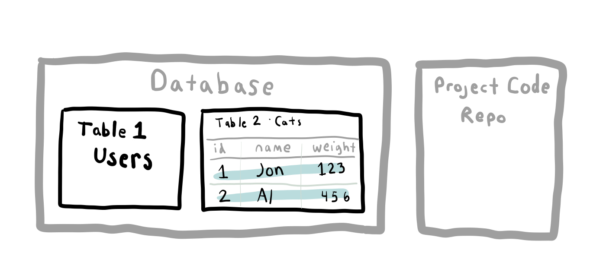

# 3.4: SQL Language

## Intro to SQL

SQL \(Structured Query Language\) is a language that describes how to manipulate data organised in tables.

It's distinct from the **database system**, which is the software that keeps data on the disk, and runs the SQL language to determine what data to manipulate on disk.

SQL the language simply describes how a set of conceptual data should be stored and retrieved.

So far, we've seen some different formats of data storage:

* Data stored in a plain file, separated by line endings \(\n\)
* Data stored in a plain file, but encoded in JavaScript object style \(JSON\)
* Binary data, such as images.

The literal data format stored on the hard drive is determined by the implementation of the SQL system, but the conceptual format of the data is simply a set of tables, where each row is an "entry".


You may have heard of NoSQL and be wondering what that is. NoSQL is a non-relational database implementation designed as an alternative to SQL for higher efficiency in certain use cases. SQL is more common and we will learn NoSQL later.


## SQL Data Organisation

The organisation of data in a SQL system is the following: Database &gt; Table &gt; Column/Row &gt; Cell. Cells are always within Columns and Rows, Columns and Rows are always within Tables, and Tables are always within Databases.

### Database

The data for an entire project / business / domain.

_An entire grocery business._

### Table

A set of data for one "thing" or data type. A database has many tables.

_All fruits_

### Column

One kind of data in your table. A table has a column each for every type of data that we want to track.

Unlike in the JSON file, when you create the entire table \(before there's any data inside\) the data type of each column is specified. The data types are things like numbers, booleans and strings.

_An integer number weight of a kind of fruit._ 

### Row

One set of data that represents one of the things your table tracks. 

_One fruit._

### Cell

One piece of data of the column type. A hard rule of SQL is that a cell can never contain more than one single piece of data.

_The weight data \(a number\) of one kind of fruit._

## SQL Query is Targeted Retrieval, not General Search

SQL databases for web applications typically structure and store our data so that we can retrieve specific entries efficiently without traversing through all entries. A search is a different idea, where we might search across all entries in a database for potentially relevant data.

For example, a "search" for "osman" could refer to data across multiple tables such as cat name, address, and last name, and we might want to suggest search extensions such as capitalization, singular vs. plural, and popular searches. The is what a _search engine application_ does. SQL has some of this functionality, but a typical web application is not set up to give these results through a SQL query.

