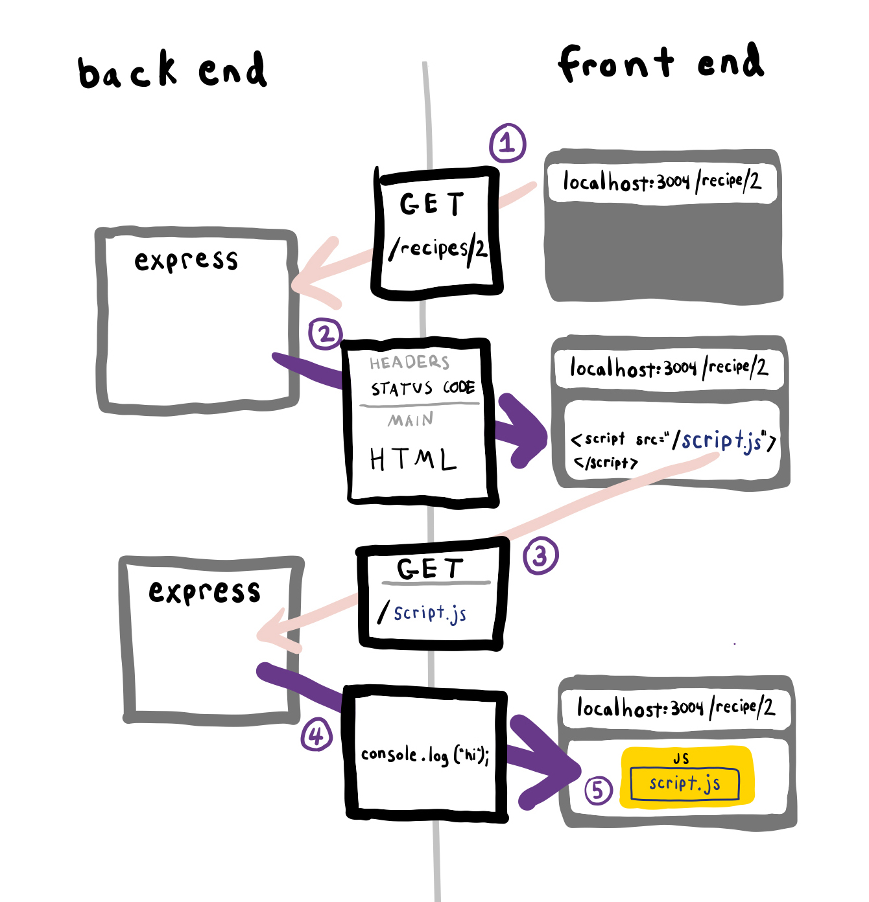

# 5.1: DOM Manipulation

We are adding back in the JavaScript from the first module.

We have now completed a journey to understand how an HTML page arrives at the browser, through a TCP/IP request built into an HTTP request- A request that results in HTML being sent back, HTML that is generated by an application with data from a SQL database.

Now that we are back in the browser we will investigate this request/response behavior that happens before the JS file runs.



1. The browser makes a request to the server.
2. The Express.js server sends back HTML.
3. The browser reads a script tag in the HTML response. The script tag src source triggers the browser to make a get request for the JavaScript automatically.
4. The Express.js server, based on the request path, looks in the hard drive for a file that matches the request and sends the file contents back in the response.
5. Because the request was kicked off from a script tag, the file contents response is digested by the JavaScript interpreter of the browser.
6. JavaScript in the browser runs.

## Exercise

Clone the [base express repo.](https://github.com/rocketacademy/base-mvc-swe1)

### Routes

Create one route: `/items`

Create a controller for this route called `items`.

Since we don't care about the database for this exercise, we won't create a model for this controller. We'll use some fake data that looks like it could have come from the database.

The controller callback will call `render` and pass in this data:

```text
const items = [
    {
        name:'banana',
        price:'$2',
        category:'fruits'
    },
    {
        name:'apple',
        price:'$1',
        category:'fruits'
    },
    {
        name:'salmon',
        price:'$22',
        category:'fish'
    },
    {
        name:'trout',
        price:'$12',
        category:'fish'
    },
    {
        name:'guava',
        price:'$3',
        category:'fruits'
    }
];
```

Create a view for this controller: `items/index.ejs`

Use a loop to render the list of items above.

### Add CSS

Add a CSS file called `styles.css` to the `public` folder. Set the background color of `body` to pink.

### Add JS

Add a `script.js` file to the `public` folder. Put a console.log in the `script.js` file.

### Revise

Open the dev tools. Confirm that the console.log appears.

Look in the elements tab. Confirm the existence of the script and link tags.

Look in the network tab. Confirm the request for the css and js files.

### Logic

Add the following logic to the script.js:

When a user clicks on any individual item, apply a class to that item to turn the background color grey.

### More Logic

When the user clicks the item again , it turns back to the original color.

