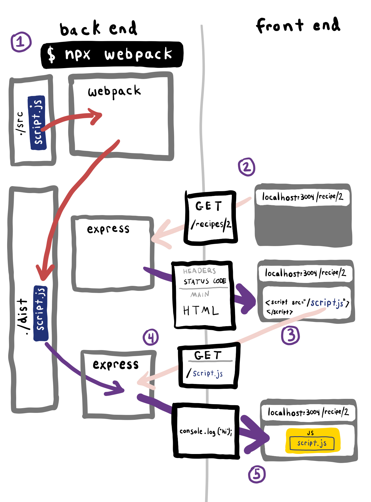

# 5.3: Webpack




1. The webpack command is run. Webpack, based on the settings, takes the src/script.js file \(or whatever other files or groups of files are specified\) and transforms it, putting the resulting file in `./dist`.
2. The browser makes a request to the server for a page.
3. The browser reads a script tag in the HTML response. The script tag `src` source triggers a get request.
4. The Express.js server, based on the request path, looks in the hard drive for a file that matches the request. This script tag requests the transformed `script.js` file in `./dist`.
5. Because the request was kicked off from a script tag, the file contents response is digested by the JavaScript interpreter of the browser.

```text
mkdir webpack-demo
cd webpack-demo
npm init -y
npm install webpack webpack-cli --save-dev
```

[https://webpack.js.org/guides/getting-started/](https://webpack.js.org/guides/getting-started/)

