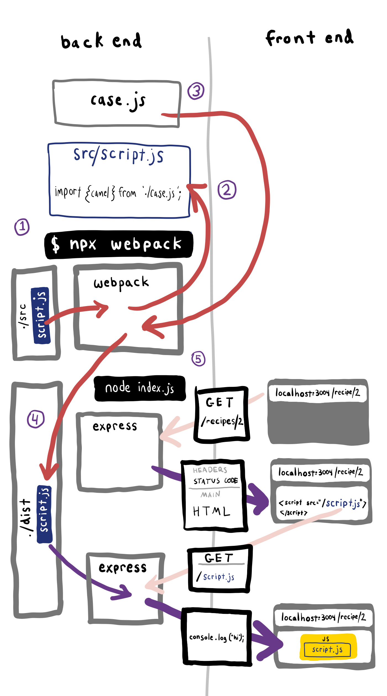

# 6.1.1: Webpack Modules

With Webpack the ability to pre-compile our front-end code allows us to have many secondary benefits.

One is the ability to use the import statement in our code. With import we get a few improvements:

1. The order of the script tags in the HTML file implies the order of the JavaScript code that needs to run. With import we can be explicit about this.
2. We get the default behavior of import, which is that one file is completely separated from another.
3. In the next part we'll use NPM.

Webpack bills its main feature as a "module bundler". See more about this functionality here: [https://webpack.js.org/concepts/](https://webpack.js.org/concepts/).

## Webpack Import

Webpack will intelligently transform our import statements in the source JavaScript files into a single output file.



1. The `webpack` command is run on the command line.
2. Webpack reads an `import` statement in the source `script.js` file.
3. Webpack, based on the `import` statement in the source `script.js` file gets all of the relevant javascript- if the module includes other modules, it gets those too.
4. The full file is written out into the `dist` directory.
5. At some later point the server is started with `node index.js`. A request is made to the server.
6. Etc.

## Import Example

Create a directory and install Webpack

```text
mkdir import-webpack-demo
cd import-webpack-demo
npm init -y
npm install webpack webpack-cli --save-dev
```

Create some files to work with:

```text
mkdir src dist
touch src/script.js
touch src/case.js
touch dist/index.html
```

#### src/case.js

```text
export function camel(input){
  return input.split(' ').join('_');
}

export function scream(input){
  return input.toUpperCase();
}
```

#### src/script.js

```text
import { camel } from './case.js';

const component = () => {

  // make a container
  const div = document.createElement('div');
  
  // display element
  const span = document.createElement('span');
  
  // input
  const input = document.createElement('input');

  // on change, display in the span
  input.addEventListener('change', function(){
  
    // use the imported code
    span.innerText = camel( input.value );
  });

  div.appendChild( input );
  div.appendChild( span );

  return div;
}

document.body.appendChild(component());
```

#### dist/index.html

```text
 <!DOCTYPE html>
 <html>
   <head>
     <meta charset="utf-8" />
     <title>Getting Started</title>
   </head>
   <body>
    <script src="script.js"></script>
   </body>
 </html>
```

### Webpack configuration:

#### webpack.config.js

```text
const path = require('path');

module.exports = {
  entry: './src/script.js',
  output: {
    filename: 'script.js',
    path: path.resolve(__dirname, 'dist'),
  },
};
```

## Run Webpack

```text
npx webpack --mode=production
```

### `dist/script.js`

Look in the generated script file. The imported JavaScript will be in this single file.

To see a formatted version of this output file, install the [Beautify plugin for VSCode.](https://marketplace.visualstudio.com/items?itemName=HookyQR.beautify)

### Production

The `production` option on the command gives a default set of configurations of which transformations are happening.

See a full list here: [https://webpack.js.org/configuration/mode/](https://webpack.js.org/configuration/mode/)  here: [https://webpack.js.org/configuration/mode/\#mode-production](https://webpack.js.org/configuration/mode/#mode-production) and here: [https://webpack.js.org/plugins/module-concatenation-plugin/](https://webpack.js.org/plugins/module-concatenation-plugin/)


Note that is quite rare to configure Webpack from scratch. Here we used the normal production configuration like would be used in the workflow described in the illustration above. Don't worry about knowing much about the default transformations.


Notice how Webpack chose to format the final version of the code. Notice that the second function in `case.js` is not in the final version of the file.

Make some changes to the code to see how it affects the code when you run Webpack again.


