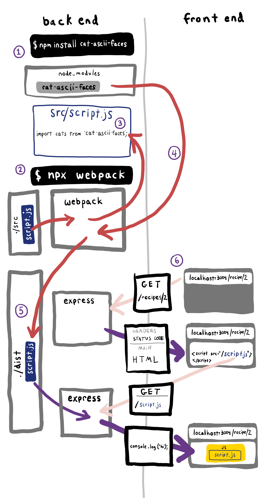

# 6.1.2: Webpack with NPM Modules

## Introduction

[Module 6.1.1: Webpack with Local Modules](6.1.1-webpack-with-local-modules.md) shared how Webpack can compile local modules into a distribution file. Here we will see how Webpack compiles 3rd-party NPM modules.

## Webpack Import with NPM Modules Order of Events

Webpack will transform the source JS file and all dependencies specified in import statements into a single distribution file.



1. `npm install` is run on the command line. The package files are stored in the `node_modules` directory.
2. The `webpack` command is run on the command line.
3. Webpack reads an `import` statement in the source `script.js` file.
4. Based on the `import`, Webpack retrieves all dependency code. If the imported module depends on other modules, Webpack retrieves those modules too.
5. Webpack writes the compiled file into the `dist` directory.
6. The server is started with `node index.js`. A request is made to the server. The server responds with the compiled JS file in `dist`.

## Webpack Import with NPM Modules Example

### Initialise Project Folder

Create new folder and install Webpack.

```text
mkdir npm-demo
cd npm-demo
npm init -y
npm install --save-dev webpack webpack-cli
```

Install a front-end package `cat-names` that we will use in our source JS file.

```text
npm install cat-names
```

Create basic folders and files that Webpack will use for compilation.

```text
mkdir src dist
touch src/script.js
touch dist/index.html
```

#### src/script.js

Populate `script.js` with the below code that uses the 3rd-party `cat-names` NPM module.

```javascript
import catNames from 'cat-names';

const component = () => {
  // make a container
  const div = document.createElement('div');

  // display element
  const span = document.createElement('span');

  // input
  const input = document.createElement('input');

  // on change, display in the span
  input.addEventListener('change', function () {
    // use cat names package
    span.innerText = input.value + ' : ' + catNames.random();
  });

  div.appendChild(input);
  div.appendChild(span);

  return div;
};

document.body.appendChild(component());
```

#### dist/index.html

Populate an `index.html` file that will load Webpack's transformed `script.js`.

```markup
<!DOCTYPE html>
<html>
  <head>
    <meta charset="utf-8" />
    <title>Getting Started</title>
  </head>
  <body>
    <script src="script.js"></script>
  </body>
</html>
```

### Configure Webpack

#### webpack.config.js

Create a file that tells Webpack what to transform and how.

```javascript
const path = require('path');

module.exports = {
  entry: './src/script.js',
  output: {
    filename: 'script.js',
    path: path.resolve(__dirname, 'dist'),
  },
};
```

### Run Webpack

```text
npx webpack --mode=production
```

Observe the imported JS from `cat-names` and the dependencies of `cat-names` will also be in the generated `script.js`. To see a formatted version of the generated file, install the [Beautify plugin for VSCode.](https://marketplace.visualstudio.com/items?itemName=HookyQR.beautify)

Not all packages can be compiled by Webpack. Try installing `pg`, importing `pg` in  `src/script.js`, and re-running Webpack.

