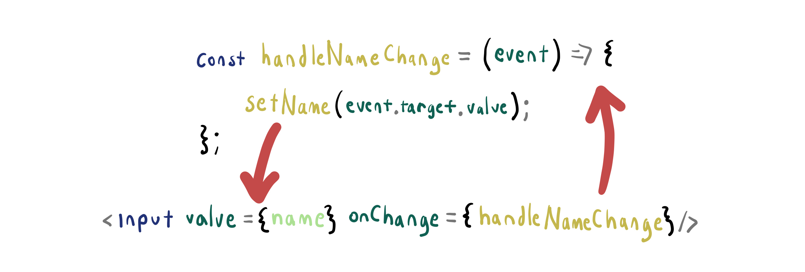

# 7.5: Controlled Forms

Form inputs are meant to be used in a specific way in React. React recommends that any form input have it's value attribute _controlled_ through the component state.

In the example below we are getting the current thing the user typed in the input using the `onChange` event callback. We are also setting the `value` attribute of the input using a state variable.

```jsx
function Form() {
  const [name, setName] = useState("");

  const handleNameChange = (event) => {
    const inputName = event.target.value;

    console.log(inputName);

    setName(inputName);
  };

  return (
    <div>
      <input value={name} onChange={handleNameChange} />
      <div>name: {name}</div>
    </div>
  );
}
```



This setup means that the event callback has total control over the form input, since we immediately set the value of the input via the state variable.

#### All Uppercase

To use the full power of a controlled input we can create an example that restricts and formats the input value and the state variable _as the user types._

On line 7 we transform the value of the input so that it's only ever uppercase, regardless of what the user typed.

```jsx
function Form() {
  const [name, setName] = useState("");

  const handleNameChange = (event) => {
  
    // state variable and input value is only upper case
    const inputName = event.target.value.toUpperCase();

    console.log(inputName);

    setName(inputName);
  };

  return (
    <div>
      <input value={name} onChange={handleNameChange} />
      <div>name: {name}</div>
    </div>
  );
}
```

#### Validation

We can also enable validation as the user types. We can use the JavaScript function [`match`](https://developer.mozilla.org/en-US/docs/Web/JavaScript/Reference/Global_Objects/String/match) and a regex to see if the string contains any non-alphabetical characters. The form validation prevents the user from typing anything non-valid into the form at all.

On line 9 we write a condition to see if we want to set the name. If we don't nothing will appear in the input when we type.

```jsx
function Form() {
  const [name, setName] = useState("");

  const handleNameChange = (event) => {
    const inputName = event.target.value;

    console.log(inputName);

    if (inputName.match(/^[a-zA-Z]+$/)) {
      setName(inputName);
    }
  };

  return (
    <div>
      <input value={name} onChange={handleNameChange} />
      <div>name: {name}</div>
    </div>
  );
}
```

### Caveats

Controlled forms/key-stroke validated forms are not necessarily the right choice for all situations. Some form validation has to wait until the input has been completely filled out. In the case of a multi-input form we would also add a button for form submit. However, this form would be able to use all the state variable values that had been set previously.

### React Docs

React docs discuss controlled forms in class component syntax here: [https://reactjs.org/docs/forms.html](https://reactjs.org/docs/forms.html)


