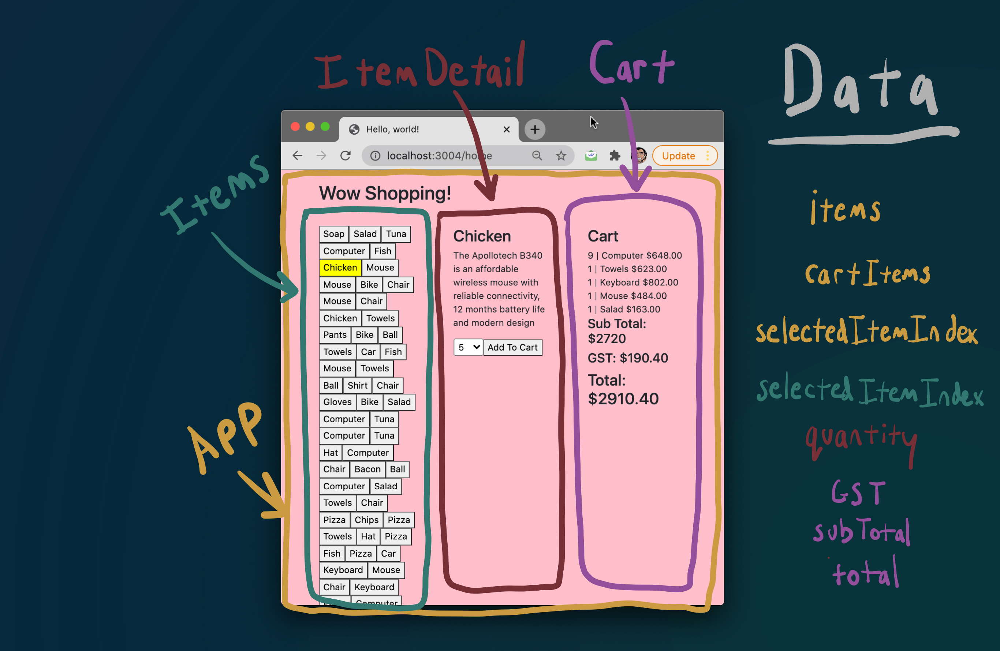

# 7.7: Component Hierarchy

## Introduction

One of the most difficult, confusing aspects of building a React app is deciding what components are responsible for what, and where the data gets stored.

We'll look at some of the principles of React app design through examples.

Note that some React best practices are what is left out, i.e., state is not created unnecessarily, data is only controlled top-down, components functionally calculate values and states where possible, etc.

## Ecommerce App

Our example is a full-stack ecommerce app. The app begins empty. When the user clicks a button a list of all available items is requested from the server.

When the user clicks on any item in the list a detail view appears.

When the user clicks the Add to Cart button, the cart is displayed with all the items. In the cart the total for all items is calculated.

See the full repo here: [https://github.com/rocketacademy/react-ecom-bootcamp](https://github.com/rocketacademy/react-ecom-bootcamp)



### App Data vs Component Data

#### Top-Level Data

Because the data about what items are in the list is needed throughout the app, we put the items array at the top level, in `App`. This is the same for all the other data we need throughout the app, such as which item is currently selected, and the array of items in the cart.

```javascript
const [items, setItems] = useState([]);
const [cart, setCart] = useState([]);
const [selectedItemIndex, setSelectedItem] = useState();
```

[https://github.com/rocketacademy/react-ecom-bootcamp/blob/main/src/App.jsx\#L9-L11](https://github.com/rocketacademy/react-ecom-bootcamp/blob/main/src/App.jsx#L9-L11)

#### Component Data

There are a few pieces of data that are not needed at the top level, such as the GST calculated on all the items in the cart and the quantity selected in the detail view.

```javascript
const subTotal = items.reduce(
  (acc, item) => Number(acc) + Number(item.price),
  0
);

const gst = subTotal * 0.07;

const total = subTotal + gst;
```

[https://github.com/rocketacademy/react-ecom-bootcamp/blob/main/src/components/Cart.jsx\#L7-L14](https://github.com/rocketacademy/react-ecom-bootcamp/blob/main/src/components/Cart.jsx#L7-L14)

### Data Flows

When we need to control the data in the app we pass a function down into the child component, who sends us up the necessary data when the user makes an action. When the user clicks to add an item to the cart, we send that item up to `App` so that it can be put into the cart array. We format the data \(to add the quantity\) before setting it in the array.

Adding an item to the cart from the `itemDetail`: [https://github.com/rocketacademy/react-ecom-bootcamp/blob/main/src/components/ItemDetail.jsx\#L14-L16](https://github.com/rocketacademy/react-ecom-bootcamp/blob/main/src/components/ItemDetail.jsx#L14-L16)

Adding the `item` into the `cart` array: [https://github.com/rocketacademy/react-ecom-bootcamp/blob/main/src/App.jsx\#L13-L15](https://github.com/rocketacademy/react-ecom-bootcamp/blob/main/src/App.jsx#L13-L15)

The setting of the `cart` array sets off the rendering of the `Cart` component and items in the cart.

