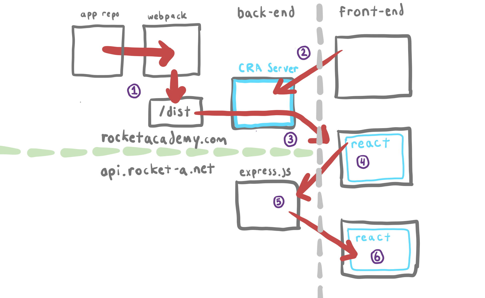

# 8.1: Create React App

[Create React App](https://create-react-app.dev/) is the officially supported demo / pre-setup React app architecture.

We are seeing this last because it comes with all the React infrastructure built-in. However, when using CRA in the real world it necessitates a different back-end architecture. We'll also be deploying an [express MVC server repo](https://github.com/rocketacademy/base-mvc-swe1) alongside our Create React App repo. These will be connected through AJAX requests made from the React app to the Express.js server. Note that in this architecture the CRA server and the express server must be different domains or sub-domains or, if they were on the same domain, another piece of architecture would be built that determines how to route requests to one or the other. In this example we'll use 2 completely different domains.



1. The React app is deployed. The webpack build process is triggered. The resulting production files are put into the /dist directory.
2. Some time later a user requests for the website with the react app on it. \(rocketacademy.com\)
3. The Create React App file server serves the HTML file and the React app JavaScript to the browser. The React app is initialized in the browser.
4. Some time later a user action causes an AJAX request to be created inside the React app. \(api.rocket-a.com\)
5. The request is received at the Express.js server. The app looks in the database and sends back a JSON response.
6. The JSON data is received and processed by the React app. React manipulates the DOM to show that data on screen.

## How To

Using Create React App \(CRA\) is easy.

```text
npx create-react-app my-app
cd my-app
npm start
```


