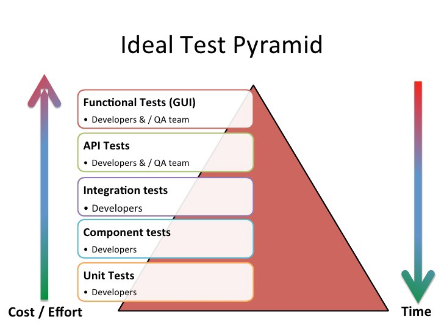
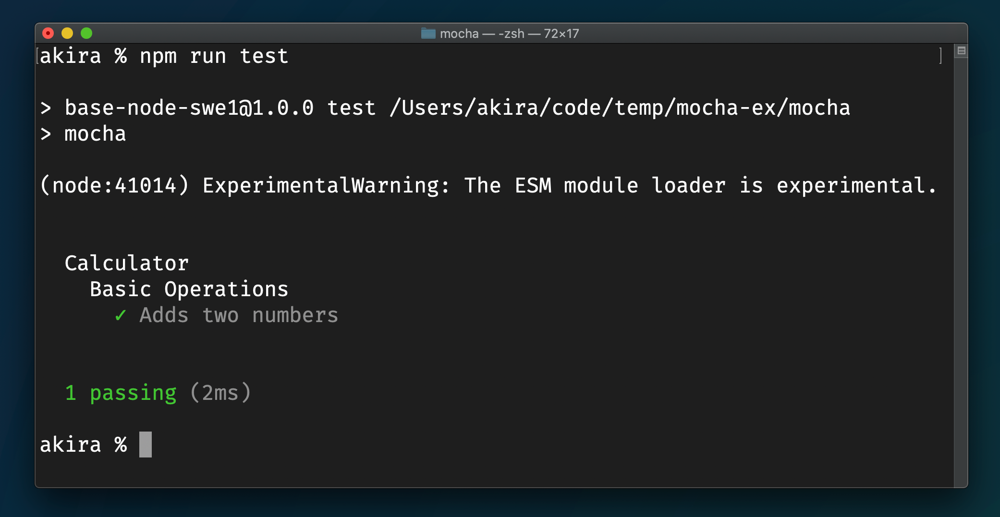

# 9.1: Testing

## Introduction



Testing generally describes an automated system that guards against bugs in an application by defining _**test cases-**_ behaviour and values that are expected from an application given a well-defined input.

There are many systems and methodologies to define the inputs and the system, we will be mostly focusing around unit tests, which are the most low level. Unit tests work with some well-defined module within the code that can be written and tested in isolation from the rest of the system.

The following are the 3 most common categories of tests.

1. Unit tests: Testing individual or small groups of functions
2. Integration tests: Testing API contracts
3. End-to-end tests: Replicating the user experience

## Testing in Industry

Testing as part of a company's normal development workflow is a defacto standard in the industry. It is considered a best-practice to have at least some testing \([like a smoke test](https://en.wikipedia.org/wiki/Smoke_testing_%28software%29)\) in place in most web applications so that new bugs are not introduced and that old features don't break. \(It is not necessarily a standard in other industries/fields such as computer graphics, mobile applications or Machine Learning\).

A standard workflow setup is to run testing as part of a [Continuous Integration](https://en.wikipedia.org/wiki/Continuous_integration) system, a system that runs tests and deploys the application automatically or at the click of a single button.

## Javascript Unit Testing

We will be using two tightly coupled libraries to run our tests: Mocha and Chai.

#### Mocha

Mocha is a "testing framework" which basically means the command line command that we run in order to kick off the tests we write. Mocha also provides wrapper functions that will run each "unit" of our tests sequentially and separately.

#### Chai

Chai is an assertion library, which means that the Chai functions we run are to verify values and states in our code.

## Setup

Let's get a simple test running with a bare-bones Mocha and Chai setup.

Clone the base repo and install the libraries.

```bash
git clone https://github.com/rocketacademy/base-node-bootcamp.git mocha
```

```javascript
cd mocha
```

```javascript
npm install mocha chai
```

Mocha expects a directory called test that holds the test files.

```javascript
mkdir test
```

For this example we'll create a simple calculator to test.

```javascript
touch calculator.js
```

#### calculator.js

```javascript
export default function add(a, b) {
  return a + b;
}
```

Because we are doing unit testing, we are creating a library module to use as in this `index.js` below.

#### index.js

```javascript
import { add } from './calculator.js';

console.log(add(2, 3));
```

However, we won't be testing any functionalities inside the `index.js` itself. We'll only be running code in the `caluclator.js` file.

Now let's create the file that will run our tests.

#### test/calculator.js

```javascript
import { expect } from 'chai';

import { add } from '../calculator.js';

describe('Calculator', function () {
  describe('Basic Operations', function () {
    it('Adds two numbers', function () {
      const result = add(2, 2);
      expect(result).to.equal(4);
    });
  });
});
```

To run the tests, make a change to the `package.json`:

```javascript
{
  "name": "base-node-swe1",
  "version": "1.0.0",
  "description": "# basic-node-swe1",
  "main": "index.js",
  "scripts": {
    "test": "mocha"
  },
  "repository": {
    "type": "git",
    "url": "git+https://github.com/rocketacademy/base-node-swe1.git"
  },
  "keywords": [],
  "author": "",
  "type": "module",
  "license": "ISC",
  "bugs": {
    "url": "https://github.com/rocketacademy/base-node-swe1/issues"
  },
  "homepage": "https://github.com/rocketacademy/base-node-swe1#readme",
  "dependencies": {
    "chai": "^4.3.3",
    "mocha": "^8.3.1"
  },
  "devDependencies": {
    "eslint": "^7.12.1",
    "eslint-config-airbnb-base": "^14.2.0",
    "eslint-plugin-import": "^2.22.1",
    "nodemon": "^2.0.6"
  }
}
```

On line 7 we changed the test key so that Mocha will run:

```javascript
npm run test
```

We should then see output like this:



Let's talk about the test code and the test run output.

### Describe

On line 5 & 6 of `test/calculator.js` we are calling the `describe` function. This function segregates the different tests and formats the output according to what was called inside these functions.

### It

`it` is the smallest piece of a unit test suite. The first argument to `it` is a string that describes what this code is testing.

```javascript
it('Adds two numbers', function () {
  const result = add(2, 2);
  expect(result).to.equal(4);
});
```

#### Expect

Expect is the code that actually evaluates that a result is correct. In this case we are checking for the number 4. There are many other kinds of comparisons besides `to.equal`.

## Further Reading

1. [Mocha website](https://mochajs.org/)
2. [Chai documentation](https://www.chaijs.com/api/bdd/)
3. [Mocha & Chai tutorial](https://semaphoreci.com/community/tutorials/getting-started-with-node-js-and-mocha)

## Exercises

1. Run the above code
2. Run the test to see the output
3. Break the test on purpose to see what a failing test looks like
4. Add a `multiply` function to the calculator and write a test for it

