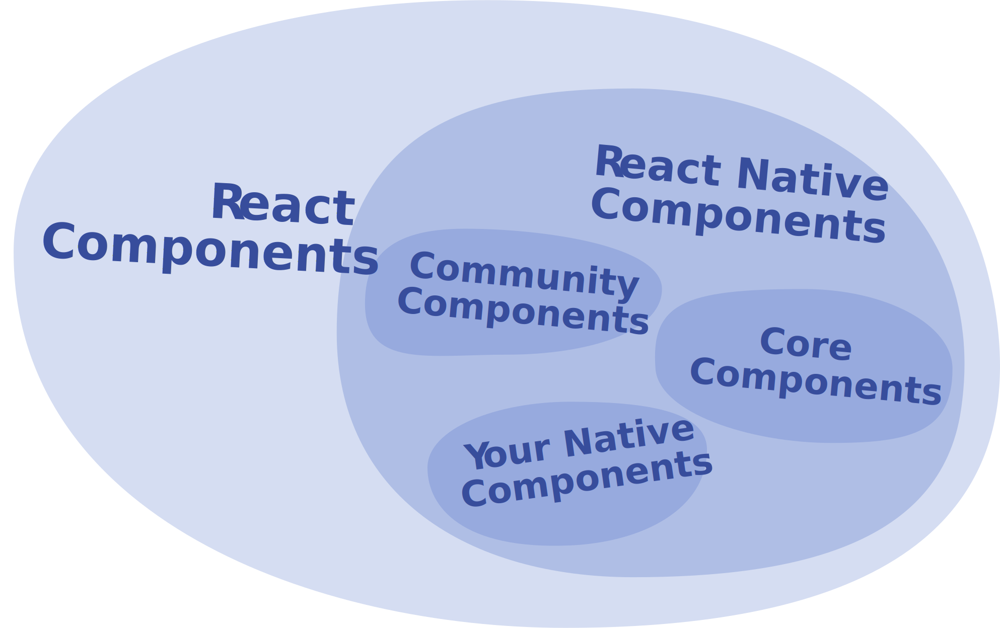

# 9.4: React Native



## Setup

[https://reactnative.dev/docs/environment-setup](https://reactnative.dev/docs/environment-setup)

```text
npm install -g expo-cli
```

Init the expo project. Choose managed blank workflow.

```text
expo init AwesomeProject

cd AwesomeProject
npm start # you can also use: expo start
```

## Components

[https://reactnative.dev/docs/intro-react-native-components\#core-components](https://reactnative.dev/docs/intro-react-native-components#core-components)

| REACT NATIVE UI COMPONENT | ANDROID VIEW | IOS VIEW | WEB ANALOG | DESCRIPTION |
| :--- | :--- | :--- | :--- | :--- |


| `<View>` | `<ViewGroup>` | `<UIView>` | A non-scrollling `<div>` | A container that supports layout with flexbox, style, some touch handling, and accessibility controls |
| :--- | :--- | :--- | :--- | :--- |


| `<Text>` | `<TextView>` | `<UITextView>` | `<p>` | Displays, styles, and nests strings of text and even handles touch events |
| :--- | :--- | :--- | :--- | :--- |


| `<Image>` | `<ImageView>` | `<UIImageView>` | `` | Displays different types of images |
| :--- | :--- | :--- | :--- | :--- |


| `<ScrollView>` | `<ScrollView>` | `<UIScrollView>` | `<div>` | A generic scrolling container that can contain multiple components and views |
| :--- | :--- | :--- | :--- | :--- |


| `<TextInput>` | `<EditText>` | `<UITextField>` | `<input type="text">` | Allows the user to enter text |
| :--- | :--- | :--- | :--- | :--- |


## Examples

Scrollview

[https://reactnative.dev/docs/using-a-scrollview](https://reactnative.dev/docs/using-a-scrollview)

```jsx
import React from 'react';
import { View, Text, Image, ScrollView, TextInput } from 'react-native';

const App = () => {
  return (
    <ScrollView>
      <Text>Some text</Text>
      <View>
        <Text>Some more text</Text>
        <Image
          source={{
            uri: 'https://reactnative.dev/docs/assets/p_cat2.png',
          }}
          style={{ width: 200, height: 200 }}
        />
      </View>
      <TextInput
        style={{
          height: 40,
          borderColor: 'gray',
          borderWidth: 1
        }}
        defaultValue="You can type in me"
      />
    </ScrollView>
  );
}

export default App;
```

Text Input

[https://reactnative.dev/docs/handling-text-input](https://reactnative.dev/docs/handling-text-input)

```jsx
import React, { useState } from 'react';
import { Text, TextInput, View } from 'react-native';

const PizzaTranslator = () => {
  const [text, setText] = useState('');
  return (
    <View style={{padding: 10}}>
      <TextInput
        style={{height: 40}}
        placeholder="Type here to translate!"
        onChangeText={text => setText(text)}
        defaultValue={text}
      />
      <Text style={{padding: 10, fontSize: 42}}>
        {text.split(' ').map((word) => word && '🍕').join(' ')}
      </Text>
    </View>
  );
}

export default PizzaTranslator;
```

