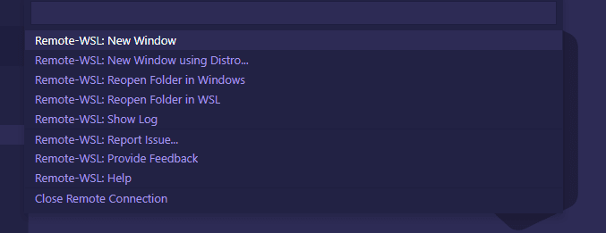
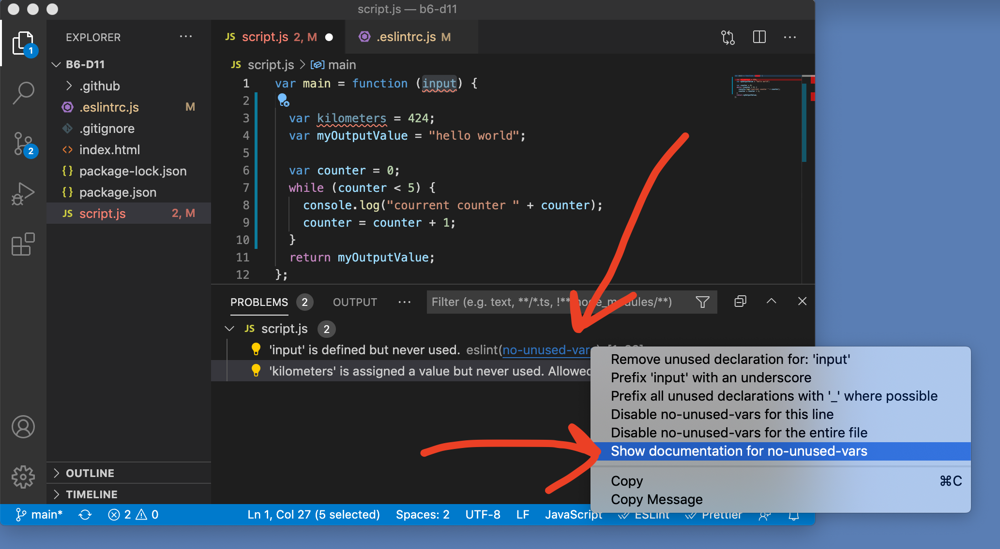

# Required Hardware and Software

## Introduction

1. If you haven't already, please make sure that you have the [required hardware and software](https://app.gitbook.com/@rocketacademy/s/basics/course-logistics/required-hardware-and-software). 
2. Please install the latest version of Windows or MacOS that your computer supports so that we can standardise the operating system version used by students across the board.

## Windows

### Windows Subsystem for Linux \(WSL\)

1. WSL allows us to run the Linux operating system on Windows machines. This is desirable because all web programming is done on Unix-based operating systems, of which MacOS is a descendant.
2. Most SWEs using Windows machines at tech companies do their work in WSL to maximise compatibility between their work and work done on Linux machines.
3. Before installing WSL, make sure you have updated your Windows version.

#### WSL

WSL is the virtual machine environment that allows us to run other operating systems inside Windows. Install WSL [here](https://docs.microsoft.com/en-us/windows/wsl/install-win10).

#### Ubuntu

We will use the Ubuntu Linux "distro" or distribution. Install the latest version of Ubuntu [here](https://www.microsoft.com/en-sg/p/ubuntu-2004-lts/9n6svws3rx71).

### WSL and VSCode

#### Sudo

`sudo` is the command that tells the computer to execute a command as an admin \(root user\).

#### Apt

Apt is the package management system in Ubuntu. On a clean new Ubuntu install we run the 2 commands below to make sure that we have the latest package records and that everything is updated.

```text
sudo apt update
sudo apt upgrade
```

#### Build Essential

Running the command below installs the standard libraries that Ubuntu needs in order to properly install common packages.

```text
sudo apt install build-essential
```

#### SSL

WSL communicates with VSCode using the SSL protocol. We need to run the following command to get the SSL verification certificates on Ubuntu for this to work correctly.

```text
sudo apt-get install ca-certificates
```

### Remote Development

VSCode will integrate into Ubuntu automatically. The VSCode terminal will show the Ubuntu terminal.


If you were using the Git Bash terminal before, after following these instructions you **must only use the Ubuntu terminal** from now on.


1. Install the [Remote Development extension](https://marketplace.visualstudio.com/items?itemName=ms-vscode-remote.vscode-remote-extensionpack) for VSCode.
2. Once you install the extension, you will see a Remote Development extension icon at the bottom left corner of the VS Code editor.


1. Click on the icon,  a pop up will appear with a list of options. Click on the first option "**Remote-WSL: New Window**" for the default distro or select the "**Remote-WSL: New Window using Distro**" for a specific distro.



1. You will see a notification "Starting VS Code in WSL...". This means VS Code is setting up a server inside WSL for the first time. Once installed, the VS Code of your Windows machine/desktop will communicate with VS Code server on the Linux side.

[](https://res.cloudinary.com/practicaldev/image/fetch/s--hQNq4fVk--/c_limit%2Cf_auto%2Cfl_progressive%2Cq_auto%2Cw_880/https://dev-to-uploads.s3.amazonaws.com/i/3667py1lgpqwwl1ijafz.png)

#### Install Node.js

Open an Ubuntu terminal and follow [install instructions](https://github.com/nodesource/distributions/blob/master/README.md#installation-instructions), copied below. Read more about these install instructions [here](https://dev.to/ajeet/the-ultimate-guide-to-use-vs-code-with-windows-subsystem-for-linux-wsl-51hc).

```text
curl -sL https://deb.nodesource.com/setup_15.x | sudo -E bash -
sudo apt-get install -y nodejs
```

## Mac

### XCode Command Line Tools

XCode command line tools install relevant command line utilities such as Git for us to use our command line on Mac effectively.

```bash
 xcode-select --install
```

### Homebrew

Homebrew is a package manager for MacOS that allows developers to have a single source of truth for which packages are installed and what versions they are. This is typically only relevant to packages for the command line; GUI applications are typically not installed via Homebrew.

Homebrew typically manages OS-specific packages and not application-specific packages. Application-specific packages are typically managed by application-level package managers such as `npm` or `pip`. Application-specific packages are packages that are typically bundled and deployed together with an application, regardless of where those applications are running.

Follow the install instructions at: [https://brew.sh/](https://brew.sh/)

### Node.js

Install Node.js using Homebrew.

```text
brew install node
```

## VSCode Formatters

Moving on from Basics, we'll upgrade the kind of auto-formatting and linting that VSCode has to offer. We'll be switching from using Prettier formatter to ESLint, which has more configuration options and has more awareness of specific JavaScript syntaxes and style points. This needs to be installed on the local computer as well as integrated with VSCode.

### Prettier

Prettier is a code formatter that will auto-format our code and make it more readable when we save our files. Install the Prettier extension for VSCode [here](https://marketplace.visualstudio.com/items?itemName=esbenp.prettier-vscode).

### ESLint

ESLint is a code formatter specifically for JavaScript that helps us detect functional errors in our code prior to running it.

#### Windows

```text
sudo npm install -g eslint
```

Install ESLint by running `sudo npm i -g eslint` from the terminal in VSCode. Enter your computer's password if prompted.

#### Mac

```text
npm install -g eslint
```

#### VSCode ESLint Extension

Install the ESLint extension for VSCode [here](https://marketplace.visualstudio.com/items?itemName=dbaeumer.vscode-eslint).

### VSCode Formatting Settings

ESLint requires that we make some changes to the VSCode configuration file.

1. Open VSCode and open the command prompt with `Ctrl+Shift+P` on Windows and `Cmd+Shift+P` on Mac.
2. Start typing `Preferences: Open Settings (JSON)` and select this option when you see it in the search dropdown. A JSON settings file should open in VSCode.
3. Replace the contents of the file with the following settings code. Save the file and restart VSCode.

```text
{
  "editor.defaultFormatter": "esbenp.prettier-vscode",
  "[javascript]": {
    "editor.defaultFormatter": "dbaeumer.vscode-eslint"
  },
  "editor.formatOnSave": true,
  "editor.formatOnPaste": true,
  "editor.minimap.enabled": true,
  "editor.tabSize": 2,
  "editor.wordWrap": "on",
  "eslint.format.enable": true,
  "eslint.lintTask.enable": true,
  "eslint.migration.2_x": "off"
}
```

#### ESLint Suggestion Highlighting \(No Action Needed\)

As we code, ESLint may suggest fixes to our code by highlighting errors. Some of these fixes are optional but others may cause our programs to break.


To see what errors we have in our code, we can view the suggestion messages in the console.




To view messages in the console, use the following steps.

1. Click the error icon in the bottom left of the VSCode footer. This will show the suggestion pane below our code.
2. For each suggestion there will be a line in the suggestion pane with a sentence about what ESLint suggests, and the relevant line number in the code file.

#### ESLint rules

ESLint integrates with specific JavaScript syntax and style rules, giving warnings for syntax errors, which will result in Javascript errors, and style errors, which may contribute to logical errors or simply make the code harder to read.

#### AirBnB Style Rules

RA implements the AirBnB ESLint style rules, which is an extention of the base ESLint rules.

Read some more details about the rules here:

* [https://medium.com/docon/airbnb-javascript-style-guide-key-takeaways-ffd0370c053](https://medium.com/docon/airbnb-javascript-style-guide-key-takeaways-ffd0370c053)
* [https://github.com/airbnb/javascript](https://github.com/airbnb/javascript)

## Other VSCode Extensions

1. Install VSCode's [Open in Browser extension](https://marketplace.visualstudio.com/items?itemName=techer.open-in-browser) to make it easier to open HTML files in our browser from VSCode.

## Folder Organisation

In Coding Bootcamp we will be cloning starter code many times for new projects. To keep things organised, we recommend the following folder structure.


Names of all files and folders should be in kebab-case, i.e, lowercase and hyphenated \(for example,`new-file.txt`\), for ease of use on the command line.



 It is generally a bad idea to have files or folders with spaces in their names \(e.g, `new file.txt`\).



Please do not store your code in a local folder synced to Google Drive. This will cause issues during Bootcamp, such as package installations running slowly. Apple iCloud has been ok so far.


### Folder Organisation - Mac

1. Host all Coding Bootcamp code in a folder called `bootcamp`.
2. Within the `bootcamp` folder, for each week \(there are 24 total\) in Coding Bootcamp, create a new folder for that week. This means you will have 24 week-specific folders, such as `week1`, `week2`, ..., `week24`.
3. Within each `weekX` folder, create 1 folder for each day of the week, i.e. `day1`, `day2`, ..., `day5`.
4. Within each `dayX` folder, create `pre-class`, `in-class`, and `post-class` folders for the respective exercises.
5. Within each `X-class`folder, keep a separate folder for every exercise you do that requires a new Git repo.
6. Store projects within a `projects` directory directly within the `bootcamp` folder for easy accessibility.

### Folder Organisation - Windows

Because the Back-end portions of the course change the way we run our code, we will be changing the location of our code from that point forward as well.

1. For Weeks 1 & 2 and Project 1, host code in a folder called `bootcamp`.
2. Within the `bootcamp` folder, for each week 1 & 2 in Coding Bootcamp, create a new folder for that week. This means you will have 2 week-specific folders, such as `week1`, `week2`
3. Within each `weekX` folder, create 1 folder for each day of the week, i.e. `day1`, `day2`, ..., `day5`.
4. Within each `dayX` folder, create `pre-class`, `in-class`, and `post-class` folders for the respective exercises.
5. Within each `X-class`folder, keep a separate folder for every exercise you do that requires a new Git repo.
6. Store projects within a `projects` directory directly within the `bootcamp` folder for easy accessibility.
7. For Weeks 3 \(Module 2\) onwards we will store files inside the WSL part of the computer. Create a directory called `bootcamp` in the home \(`~`\) folder of the Ubuntu system.
8. Name the weeks and days as above.
9. Do not save any of the files from Week 3 \(Module 2\) onwards in the Windows side of the computer.

