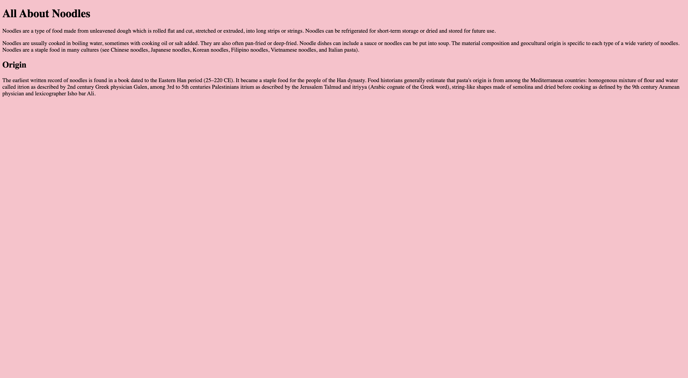
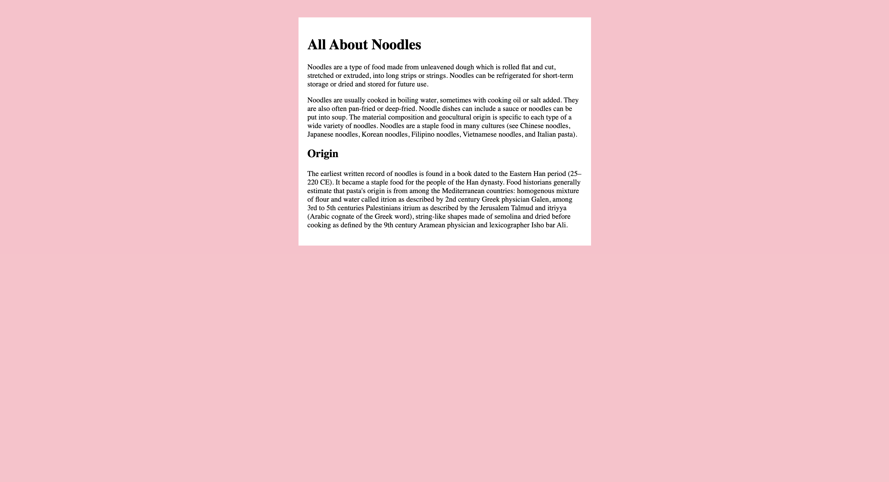

# CSS.2.4: Layout: Fixed, Percent Width & Max Width

## Layout with Block

When we create our CSS layouts we'll be using container elements. These will form the underlying structure of our page layout. The first of these elements will be block elements. We will mostly use `div` elements as a plain, generic CSS layout container element.

Given this HTML:

```markup
<!doctype html>
<html lang="en">
  <head>
    <meta charset="utf-8">

    <link href="styles.css" rel="stylesheet">
  </head>
  <body>
    <div class="main">

      <h1>All About Noodles</h1>

      <p>Noodles are a type of food made from unleavened dough which is rolled flat and cut, stretched or extruded, into long strips or strings. Noodles can be refrigerated for short-term storage or dried and stored for future use.</p>

      <p>Noodles are usually cooked in boiling water, sometimes with cooking oil or salt added. They are also often pan-fried or deep-fried. Noodle dishes can include a sauce or noodles can be put into soup. The material composition and geocultural origin is specific to each type of a wide variety of noodles. Noodles are a staple food in many cultures (see Chinese noodles, Japanese noodles, Korean noodles, Filipino noodles, Vietnamese noodles, and Italian pasta).</p>

      <h2>Origin</h2>

      <p>The earliest written record of noodles is found in a book dated to the Eastern Han period (25–220 CE). It became a staple food for the people of the Han dynasty. Food historians generally estimate that pasta's origin is from among the Mediterranean countries: homogenous mixture of flour and water called itrion as described by 2nd century Greek physician Galen, among 3rd to 5th centuries Palestinians itrium as described by the Jerusalem Talmud and itriyya (Arabic cognate of the Greek word), string-like shapes made of semolina and dried before cooking as defined by the 9th century Aramean physician and lexicographer Isho bar Ali.</p>

    </div>

  </body>
</html>

```

## Centering a Box

For boxes whose width is smaller than the parent box there is an easy way to horizontally center them: `margin` `auto`

```css
.main{
    width: 100px;
    margin: 0 auto; /* left and right margin auto*/
}
```

## Fixed Width Layout

By using this centering technique we can make a nice box that is centralized in the middle of the page.

By constraining the size of the content area this prevents the behavior where the text is spread all the way across a horizontal box, making it hard to read.

```css
.main {
  width: 600px; /* reasonable default size of a central box */
  background-color:white;
  padding:20px;
  margin:40px auto; /* left and right margin auto*/
}
```

#### Before



#### After



## Percent Width Layout

Another kind of design might call for a box that is always a percentage with of the page.

```css
.main {
  width: 80%;
  background-color:white;
  padding:20px;
  margin:40px auto; /* left and right margin auto*/
}
```

## Max Width

One major issue with this CSS is that if the device screen is less than 600px, the page will be cut off and scroll to one side.

To prevent this we can have it take up the entire screen width below a certain size. \(To put it conversely, we can constrain the size of the box to no more than a certain number\).

```text
.main {
  max-width: 600px; /* be 100% width, until 600px */
  background-color:white;
  padding:20px;
  margin:40px auto; /* left and right margin auto*/
}
```

## Height

Notice that in the examples the white box does not take up the rest of the vertical space of the page. This is because elements only fill up to the size in the vertical dimension. Some of these height issues can be solved with the Bootstrap library and/or flexbox.

