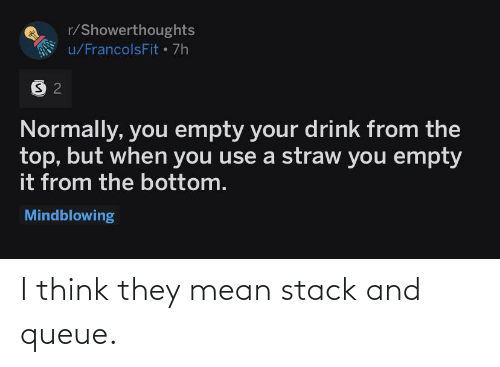

# D.6.4: Queues

## Introduction

Queues are similar to stacks except instead of removing elements from the end of a list, we can only remove elements from the front of a list. Instead of push and pop operations, queues have "enqueue" and "dequeue" operations respectively. Enqueue adds an element to the back of a queue, and dequeue removes an element from the front of a queue.

## Helpful Resources

1. [This](https://www.youtube.com/watch?v=9Obx8TTQnaY) video is a concise introduction for the motivation and usage of queues.
2. [This](https://www.youtube.com/watch?v=Y7wZO2tMjnY) video is a more detailed introduction to queues and how to use them in Python.
3. Read pages 109-110 in the [Cracking the Coding Interview PDF](../d.0-dsa-overview.md#resources).

## Code Example

Please read and understand the queue class definition in [this](https://repl.it/@kaiyuanneo/queue-class-definition#main.py) Repl. Notice we Python's built-in `deque` data structure because it supports more efficient popping \(dequeuing\) of the left-most element than Python Lists.

## Exercises

Please use Python's `deque` data structure to represent queues.

### Pre-Class

1. [https://repl.it/@kaiyuanneo/queues\#main.py](https://repl.it/@kaiyuanneo/queues#main.py)
   1. Solutions: [https://repl.it/@kaiyuanneo/queuessoln\#main.py](https://repl.it/@kaiyuanneo/queuessoln#main.py)

### Part 1

1. [https://leetcode.com/problems/find-the-most-competitive-subsequence/](https://leetcode.com/problems/find-the-most-competitive-subsequence/)
   1. Hint: Consider using both queue and stack methods

### Part 2

1. [https://leetcode.com/problems/task-scheduler/](https://leetcode.com/problems/task-scheduler/)

