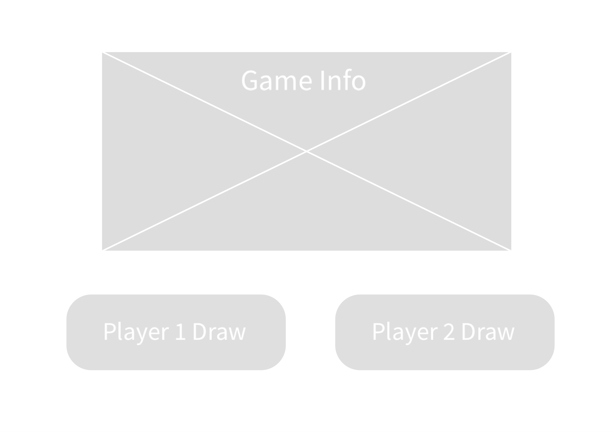
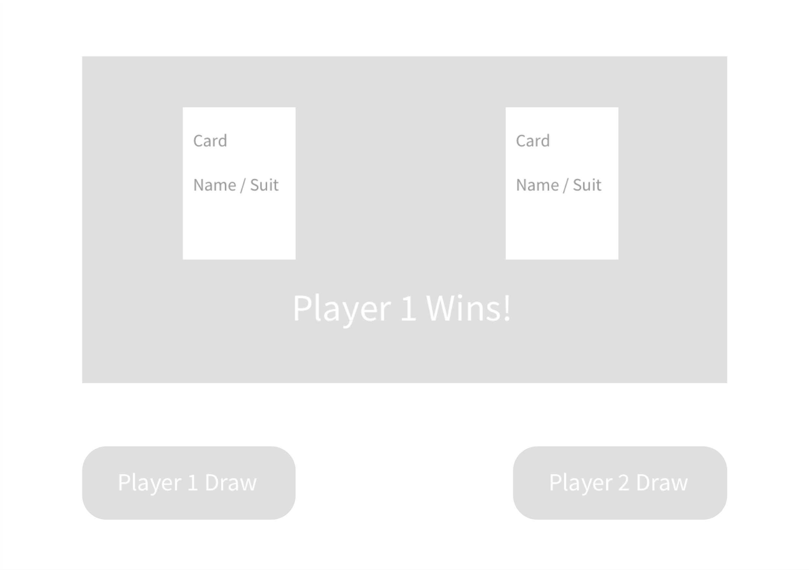

# New High Card



The basic high card game is relatively similar to the original, non-DOM game.

```javascript
// get a random index from an array given it's size
var getRandomIndex = function (size) {
  return Math.floor(Math.random() * size);
};

// cards is an array of card objects
var shuffleCards = function (cards) {
  var currentIndex = 0;

  // loop over the entire cards array
  while (currentIndex < cards.length) {
    // select a random position from the deck
    var randomIndex = getRandomIndex(cards.length);

    // get the current card in the loop
    var currentItem = cards[currentIndex];

    // get the random card
    var randomItem = cards[randomIndex];

    // swap the current card and the random card
    cards[currentIndex] = randomItem;
    cards[randomIndex] = currentItem;

    currentIndex = currentIndex + 1;
  }

  // give back the shuffled deck
  return cards;
};

var makeDeck = function () {

  // create the empty deck at the beginning 
  var deck = [];

  var suits = ['hearts', 'diamonds', 'clubs', 'spades'];

  var suitIndex = 0;
  while (suitIndex < suits.length) {

    // make a variable of the current suit
    var currentSuit = suits[suitIndex];
    console.log("current suit : " + currentSuit)

    // loop to create all cards in this suit
    // rank 1-13
    var rankCounter = 1;
    while (rankCounter <= 13) {
      var cardName = rankCounter;

      // 1, 11, 12 ,13
      if (cardName == 1) {
        cardName = 'ace';
      } else if (cardName == 11) {
        cardName = 'jack';
      } else if (cardName == 12) {
        cardName = 'queen';
      } else if (cardName == 13) {
        cardName = 'king';
      }

      // make a single card object variable
      var card = {
        name: cardName,
        suit: currentSuit,
        rank: rankCounter
      };

      console.log("rank : " + rankCounter);

      // add the card to the deck
      deck.push(card);
      
      rankCounter = rankCounter + 1;
    }
    suitIndex = suitIndex + 1;
  }

  return deck;

};

var deck = shuffleCards( makeDeck() );

var playersTurn = 1; // matches with starting instructions
var player1Card;

// create two buttons
var player1Button = document.createElement('button');
player1Button.innerText = 'Player 1 Draw';

var player2Button = document.createElement('button');
player2Button.innerText = 'Player 2 Draw';

// create game info div as global value
// fill game info div with starting instructions
var gameInfo = document.createElement('div');
gameInfo.innerText = 'Its player 1 turn. Click to draw a card!';

player1Button.addEventListener('click',function(){
  if( playersTurn == 1 ){
    player1Card = deck.pop();
    playersTurn = 2;
  }
});

player2Button.addEventListener('click',function(){

  if( playersTurn == 2 ){
  
    var player2Card = deck.pop();
    playersTurn = 1;

    if( player1Card.rank > player2Card.rank ){
      
      output('player 1 wins');
    }else if( player1Card.rank < player2Card.rank ){
    
      output('player 2 wins');
    }else{
    
      output('tie');
    }
  }
});

// don't write the dom manipulation
// code inline in the conditional
// create a helper function for output
var output = function(message){
  gameInfo.innerText = message;
};
```

### High Card Output



DOM allows us to affect what we see on the screen in a more comprehensive way.

When working with DOM \(HTML\) elements and visual output we'll also use a few principals to make our code easier to write:

1\) Hard code the HTML first to figure out what structure you need, before coding the JavaScript for that element.

2\) When applying CSS to an element we can control the styles with the element CSS class \(or set of classes\). Unless absolutely necessary, we'll avoid directly applying any CSS styles to a DOM element.

3\) Try to write a helper function for every element that gets affected or put on screen. Think about this as passing a specific set of values out of your main logic. Don't mix your element structure and styles with your logic.

This might be the HTML we want for a single card:

```markup
<div class="card">
    <div class="name red">3</div>
    <div class="suit">♥️</div>
</div>
```

The CSS for these elements might look like this:

```css
.card{
    margin:10px;
    padding:10px;
    background-color:grey;
    width:50px;
    text-align:center;
    border-radius:8px;
}
.suit{
    margin: 5px;
    font-size:20px;
}
.name{
    margin: 5px;
    font-size:24px;
    font-weight:bold;
    font-family:sans-serif;
}
.red{
    color:red;
}
```

We should be able to test this code in the HTML file.


The JavaScript to build this element might look like this:

```javascript
var suit = document.createElement('div');
suit.classList.add('suit');
suit.innerText = '♥️';

var name = document.createElement('div');
name.classList.add('name','red');
name.innerText = '3';

var card = document.createElement('div');
card.classList.add('card');

card.appendChild(name);
card.appendChild(suit);
```

